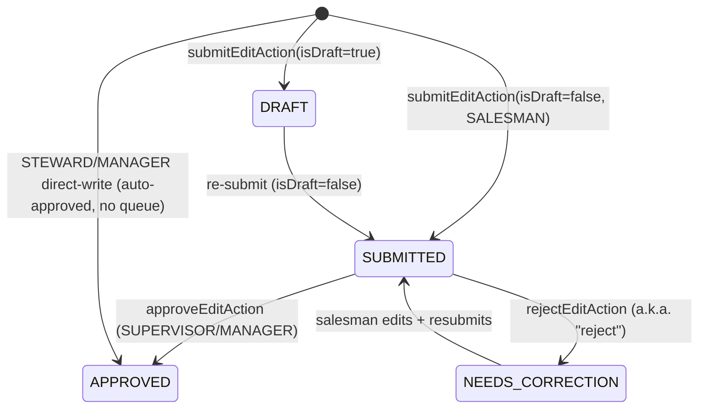
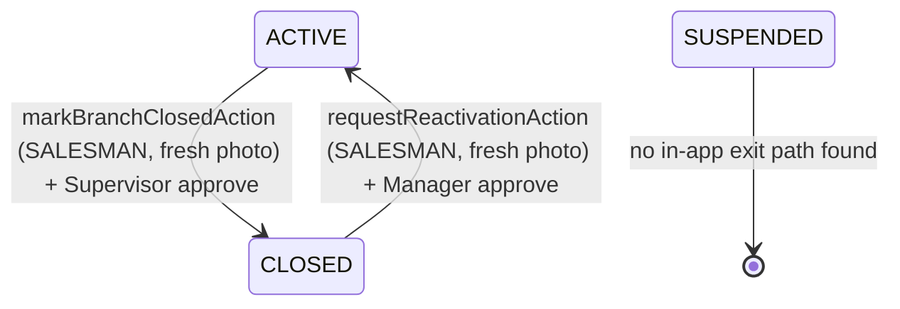

# NMWC Customer Master — Functional Reverse-Engineering (NEW system)

Discovery-only. System root: `C:\Users\abdulr\Desktop\NMWC-CRM`. Stack: Next.js 15 App Router (RSC + Server Actions), Auth.js v5 (JWT), Prisma + PostgreSQL (Neon), Cloudflare R2, bcryptjs. All paths below are relative to the system root.

---

## 0. Confirmed facts vs inferences vs missing

- **CONFIRMED**: all role logic, auth chain, state machine, and journeys below were read directly in code (file:line cited).
- **INFERENCE**: labelled `[Highly likely]`/`[Possible]`.
- **MISSING/UNVERIFIED**: no runtime DB was queried; seed/reference data content assumed from `prisma/seed.ts`. Actual production reference rows unknown.

---

## 1. Access & Authentication

### Who can access
Five roles, from `enum Role` — `prisma/schema.prisma:15-21`: **SALESMAN, SUPERVISOR, MANAGER, STEWARD, VIEWER**. [Confirmed]

### Login trace
1. **Login page** `app/(auth)/login/page.tsx` renders `components/nmwc/LoginForm.tsx`, which posts to `loginAction` (`app/actions/auth.ts:19`). [Confirmed]
2. `loginAction` lowercases username, rate-limits per-user + per-IP (`checkLimit('login:user:…' / 'login:ip:…', LOGIN_LIMIT)`, `app/actions/auth.ts:31-55`), then calls `signIn('credentials', { redirectTo: '/home' })`. [Confirmed]
3. **Credential verification** is in the Credentials provider `authorize()` — `lib/auth.ts:236-330`:
   - zod `credentialsSchema` (username 3–50, password 1–200) `lib/auth.ts:42-45`.
   - Second rate-limit gate inside authorize (`login:user` + `login:ip`) `lib/auth.ts:249-266`.
   - **Password hashing = bcryptjs**, `bcrypt.compare(password, user.passwordHash)` `lib/auth.ts:289`. Import hashing uses `bcrypt.hash(pw, 12)` (cost 12) — `services/imports.ts:361,374`, `services/users.ts:134`.
   - **Timing-safe**: uses a pre-computed `DUMMY_BCRYPT_HASH` compare when user missing/inactive so latency doesn't leak account existence `lib/auth.ts:39-40,288`.
   - Demo-account kill switch: `DEMO_ACCOUNTS_DISABLED=true` blocks seed usernames `lib/auth.ts:273-284`.
   - On success: updates `lastLoginAt`, writes `LOGIN` audit, returns `{id,name,email,username,role,mustChangePassword}` `lib/auth.ts:301-329`.
   - On failure: writes `LOGIN_FAIL` audit (or `logger.warn` for unknown users, since `AuditLog.actorId` FK can't reference a non-existent user) `lib/auth.ts:112-129,290-298`.
4. **JWT strategy**, `maxAge = 8h` (`auth.config.ts:14`). JWT callback `lib/auth.ts:148-218` re-reads the User row every **5 min** (`JWT_FRESHNESS_MS`) to honour disable/role-change/password-reset, and hard-revokes any token whose `iatMs < user.sessionsRevokedAt` (AUTH-12 immediate revocation) `lib/auth.ts:190-199`. [Confirmed]
5. **Cookie hardening**: `__Secure-authjs.session-token` in prod, `httpOnly`, `sameSite=lax`, `secure` `auth.config.ts:19-32`. [Confirmed]
6. **Middleware** `middleware.ts` + `authorized()` callback — **correction 2026-09-15: the deny path does NOT gate anything** (a boolean return is discarded by next-auth beta.31 when middleware wraps a function; see register.md C1). The redirect paths in the same callback DO fire. Public = public = `/login`, `/api/auth`, `/api/health`, `/_next`, `/favicon.ico`. Also enforces **mustChangePassword** redirect to `/profile/change-password` `auth.config.ts:75-84`. Middleware also injects a per-request CSP nonce `middleware.ts:50-68`. [Confirmed]
7. **Logout** `logoutAction` (`app/actions/auth.ts:72-100`) bumps `sessionsRevokedAt` BEFORE clearing the cookie, writes `LOGOUT` audit. [Confirmed]

### Secret handling
`.env` / `.env.local` are **gitignored** (`.gitignore` "Env" block); only `.env.example` is tracked (`git ls-files`). Local `.env` contains var names `DATABASE_URL`, `DIRECT_URL`, `NEXTAUTH_SECRET`, `SENTRY_AUTH_TOKEN`, `SEED_ADMIN_PASSWORD` (values not committed). `assertAuthSecret()` refuses low-entropy/short `AUTH_SECRET` in prod `lib/auth.ts:17-32`. No secrets committed to git. [Confirmed]

---

## 2. Role permission matrix

Central helpers: `lib/permissions.ts` (RBAC) + `lib/access.ts` (data scope). Navigation surface: `components/nmwc/Sidebar.tsx:28-61`.

| Capability | SALESMAN | SUPERVISOR | MANAGER | STEWARD | VIEWER | Evidence |
|---|---|---|---|---|---|---|
| See customers | own route only | team's routes | managed regions (fail-closed if none) | all | all | `access.ts:67-97` |
| Create customer | ❌ (no UI at all) | ❌ | ❌ | via **import promote** only | ❌ | `services/imports.ts:820`, no `customer.create` in app code |
| Edit customer (enrich) | own route | ❌ (approves) | managed regions (direct-write) | all (direct-write) | ❌ | `access.ts:138-156`, `edits.ts:259-264` |
| Submit edit for approval | ✅ | ❌ | direct-write (auto-approved) | direct-write | ❌ | `edits.ts:259-264,421` |
| Approve/reject edit | ❌ | ✅ (own reports only) | ✅ (region overlap) | ❌ | ❌ | `permissions.ts:125-145` |
| Approve/reject reactivation | ❌ | ❌ | ✅ (own region) | ❌ | ❌ | `reactivations.ts:225,314` |
| Import (customer + account master) | ❌ | ❌ | ❌ | ✅ only | ❌ | `imports.ts:27-34` |
| Merge / dismiss duplicates | ❌ | ❌ | ❌ | ✅ only | ❌ | `duplicates.ts:20-27` |
| Export | ❌ | ✅ | ✅ | ✅ | ✅ | `permissions.ts:39-46` |
| Manage users (create/disable/reset/role) | ❌ | ❌ | ✅ (not peer MGR/STW) | ❌ (only via import, capped) | ❌ | `users.ts:20-27`, `permissions.ts:152-172` |
| Attach/detach photos | own route | ❌ | ✅ (FORCE_OVERRIDE audit) | ✅ | ❌ | `photos.ts:77-83,285-290` |
| View audit log | ❌ | ❌ | ✅ | (page-gated) | ❌ | Sidebar `MANAGER`→`/audit` |

Key RBAC nuances [Confirmed]:
- **Field locks** `isFieldLocked` `permissions.ts:70-80`: for SALESMAN `legalName` + `nmwcCode` ALWAYS locked; `crNumber`/`crNumberNorm` locked only when `paymentTerms === 'CREDIT'`. Steward bypasses all; non-salesman/non-steward bypass. Locks re-evaluated at approve time `edits.ts:682-692`.
- **Self-approval blocked** for every role `permissions.ts:133-134` + reactivation `reactivations.ts:251,336`.
- **Manager fail-closed**: empty `managedRegions` ⇒ sees nothing / approves nothing `access.ts:86-95`, `permissions.ts:135-142`.
- **Multi-branch scope leak fix** `filterBranchesByScope` `access.ts:107-124` strips out-of-scope branches before render.
- **Peer-admin protection** `canMutateUser` `permissions.ts:152-172`: a Manager cannot disable/reset/demote another Manager or any Steward; no self-mutation via `/users`.

---

## 3. Status / state machine

### 3a. EditState (`schema.prisma:44-50`) — the approval engine
Values: `DRAFT, SUBMITTED, APPROVED, REJECTED, NEEDS_CORRECTION`.

Transitions & routes [Confirmed]:
- `submitEditCore` `edits.ts:207` — DRAFT or SUBMITTED. One open SUBMITTED per customer enforced by app check `edits.ts:267-277` AND DB partial unique index `CustomerEdit_open_per_customer` (P2002 → ConflictError `edits.ts:465-481`).
- `approveEditCore` `edits.ts:600` — atomic claim `updateMany(state:SUBMITTED→APPROVED)` `edits.ts:767-780`, then `applyEditChanges`.
- `rejectEditCore` `edits.ts:919` — sets **NEEDS_CORRECTION**, requires reason 5–1000 chars, category.
- **NOTE / GAP** `[Confirmed]`: `EditState.REJECTED` is defined in the enum but **never written** anywhere — "reject" always writes `NEEDS_CORRECTION`. `REJECTED` is dead in the edit flow (return-for-correction is the only rejection path; there is no terminal hard-reject).
- Direct-write (Steward/Manager) skips the queue entirely: creates a row already `APPROVED` with `reviewedById = submittedById` and applies immediately `edits.ts:421-451`.
- Bulk approve/reject `edits.ts:818-913` loop over ≤50 ids, each in its own transaction.

### 3b. CustomerStatus / branch status (`schema.prisma:28-32`)
Values: `ACTIVE, CLOSED, SUSPENDED`. Same enum used for both `Customer.status` and `Branch.status`.

[Confirmed] rules:
- Status flips to/from CLOSED or SUSPENDED are **blocked in the regular edit form for ALL roles** — both at submit (`edits.ts:297-311` customer, `edits.ts:372-387` branch) and re-checked at approve (`STATUS_BYPASS`, `edits.ts:663-675`). They must go through the dedicated close/reactivate actions.
- **Close** `markBranchClosedCore` `reactivations.ts:135` — SALESMAN only, requires fresh (≤24h, captured after `lastStatusChangeAt`) shop photo; creates a `BRANCH`-target SUBMITTED edit reviewed by a **Supervisor** via the normal `approveEditCore` path.
- **Reactivate** `requestReactivationCore` `reactivations.ts:40` — SALESMAN only, branch must be `CLOSED`, same photo-freshness evidence; `isReactivation=true`; approved by a **Manager** (`approveReactivationCore` `reactivations.ts:224`). Customer flips to ACTIVE only when **all** branches active `reactivations.ts:265-274`.
- **GAPS** `[Confirmed]`: (1) **SUSPENDED is a dead-end** — nothing in-app sets a branch/customer to SUSPENDED (only import/DB), and reactivation only accepts `CLOSED` branches (`reactivations.ts:56-58`), so a SUSPENDED shop has no in-app recovery. (2) Branch closure does **not** cascade to `Customer.status = CLOSED`; customer-level CLOSED has no in-app writer. `photo evidence anchor` = `Branch.lastStatusChangeAt` (`schema.prisma:322-325`).

### 3c. ImportRowState / ImportBatchStatus (`schema.prisma:64-99`)
Row: `PENDING → CLEAN | QUARANTINED` (parse) `→ PROMOTED | REJECTED` (promote). Batch: `PARSING → READY → PROMOTING → PROMOTED | FAILED`. Promote claim is atomic `updateMany(READY→PROMOTING)` `imports.ts:709-718`. [Confirmed]

---

## 4. Complete user journeys

### J1 — Customer ENRICHMENT (the core salesman journey) [Confirmed — PRESENT]
Entry: `/today` or `/customers` → `/customers/[id]/edit` (`app/(app)/customers/[id]/edit/page.tsx`). Page redirects SUPERVISOR/VIEWER to read view (`:83-88`), enforces salesman route scope (`:90-97`), filters branches to scope (`:109`), computes `lockName`/`lockCr` (`:120-121`), and blocks submit if a SUBMITTED edit already pends (`:124-127,155`).

Form `EnrichmentForm.tsx` → `submitEditAction` (`edits.ts:201`). Client zod = `submitEditSchema` (`lib/validation/edit.ts:83-88`); server re-parses the same schema (`edits.ts:213`). Validations: phone regex 7–20 chars; **GPS bounded to Oman envelope** lat 16–27, lng 51–61 (`edit.ts:59-68`); text fields `stripHtml`; counts bounded.

Flow after submit:
1. Rate-limit `edit:<userId>` (`edits.ts:209`).
2. Load customer+branches, verify scope (`edits.ts:246-264`).
3. Drop locked fields (`edits.ts:284-289`); normalize phone/CR; log (never block) shared-phone collisions (P1.3, `edits.ts:329-341`).
4. Build `fieldChanges` diff array (customer + per-branch) `edits.ts:344-392`.
5. **Mandatory-field gate for salesman** `collectMissingMandatory` `edits.ts:98-187` — required: customer `legalName`(unless locked), `channelId`, `subChannelId`, `primaryPhone`, `contactPerson`, `crNumber`(unless CREDIT-locked), `crPhotoId`; per branch `address`(≥3), `gpsLat/Lng`, `dayOfVisit`, `shopPhotoId`, `signboardPhotoId`. Blocks SUBMIT, not DRAFT (`edits.ts:403-415`).
6. Persist `CustomerEdit` (DRAFT or SUBMITTED). Routing: goes to the **submitter's supervisor** queue (`work/page.tsx:63-72`, `submittedBy.supervisorId`).
7. **Supervisor** reviews at `/approvals/[id]` → `approveEditAction`/`rejectEditAction`. Approve re-checks locks, drops deleted/reassigned branches (`edits.ts:714-730`), **re-runs the mandatory gate** (`NEEDS_REUPLOAD` if a photo was detached post-submit, `edits.ts:739-760`), applies changes with **optimistic locking** (`version` updateMany, `VERSION_CONFLICT`, `edits.ts:503-572`), recomputes completeness, writes `APPROVE` audit with full diff.
8. Reject → `NEEDS_CORRECTION` surfaces on salesman `/rejected` + `/work` with `decisionReason`.
Notifications: **none** (no email/push); "notification" = work-queue rows + `revalidatePath`. Audit: `AuditLog` rows on approve/reject. [Confirmed]

### J2 — NEW customer CREATION [Confirmed — ABSENT as a manual flow / PRESENT only via import]
There is **no manual "create customer" page or action** in the app. `prisma.customer.create` appears only in `prisma/synthetic.ts:317` (seed) and `scripts/flatten-customer-branches.ts:137` (migration). Real creation is **Steward Excel import → promote**: `uploadCustomerMasterCore` (`imports.ts:517`) parses rows → CLEAN/QUARANTINED, `promoteCustomerBatchCore` (`imports.ts:700`) upserts `Customer` + `Branch` grouped by `custCode`, auto-creating an `UNASSIGNED` region/route fallback (`imports.ts:751-762`). Individual salesmen therefore **enrich pre-seeded skeletons**, never mint codes. `nmwcCode` uniqueness is the identity key.

### J3 — EXISTING customer MODIFICATION [Confirmed — PRESENT]
Same as J1 (the app treats every edit as enrichment of an existing record). Steward/Manager get **direct-write** (auto-approved) bypassing the supervisor queue `edits.ts:421-451`.

### J4 — CASH vs CREDIT customer processing [Confirmed — PARTIAL]
`PaymentTerms` enum CASH/CREDIT (`schema.prisma:23-26`, default CASH). The **only** behavioural difference: on CREDIT, `crNumber`/`crNumberNorm` are locked for SALESMAN (`permissions.ts:78-79`) and excluded from their mandatory gate (`edits.ts:137,154`). Import whitelists CASH/CREDIT strictly (`imports.ts:643-651`). No credit-limit, AR, or terms-approval logic exists. Payment-terms **changes** are an editable field (`CUSTOMER_FIELDS`, `edits.ts:57-68`) with no special approval.

### J5 — Individual vs Corporate customers [Confirmed — ABSENT]
No individual/corporate flag exists. Only a `Channel`/`SubChannel` taxonomy (HORECA, MODERN_TRADE, GENERAL_TRADE, CONVENIENCE_AND_GAS, ECOMMERCE, HOME_OFFICE_DELIVERY, INSTITUTIONS — `prisma/seed.ts:16-48`). Legal-entity signal is `crNumber` only. No customer "type" segmentation.

### J6 — Customer branches [Confirmed — PRESENT]
`Branch` is a first-class model (`schema.prisma:294-349`); a Customer has many branches, each with its own region/route/GPS/photos/status. Multi-branch scope filtering `access.ts:107-124`. Branch-level status flow = close/reactivate (J via §3b). Branch codes minted in import (`formatBranchCode`, `imports.ts:806-807`).

### J7 — Temporary / inactive customers [Confirmed — ABSENT / PARTIAL]
No `TEMPORARY` or `INACTIVE` status value. Closest = `CLOSED`/`SUSPENDED` (§3b) and boolean `isActive` on Region/Route/User/Channel (not on Customer). "Inactive customer" as a lifecycle concept is not modeled; CLOSED (branch-level) is the only supported deactivation.

### J8 — Rejected / suspended customers [Confirmed — PARTIAL]
"Rejected" applies to **edits** (→ NEEDS_CORRECTION, salesman `/rejected` page) and **import rows** (`ImportRowState.REJECTED`), not to customers. No customer-level "rejected" status. SUSPENDED customers can exist (from import/DB) but have no in-app transition in or out (dead-end, §3b gap).

### J9 — User provisioning [Confirmed — PRESENT]
`/users` (MANAGER) `createUserAction` (`users.ts:54`) — cannot mint MANAGER/STEWARD (`:81-86`); salesman must get a route; password ≥12; `mustChangePassword=true` forced (`:149`). Role change / disable / reset guarded by `canMutateUser`, last-Manager lockout, `sessionsRevokedAt` bump. Admin-tier users only via Steward account-master import (also blocked from minting admins, `imports.ts:261-286`).

### J10 — Duplicate merge [Confirmed — PRESENT, Steward]
`findDuplicateCandidates` (`duplicates.ts:57`) surfaces only high-confidence pairs (exact CR, or exact name+phone+region). `mergeCustomersCore` (`duplicates.ts:199`) reassigns branches+edits, soft-deletes loser, requires explicit cross-region confirmation+reason, writes `MERGE` audit. Phone duplicates are legitimate and never block (P1.3/P1.4).

---

## 5. Error / concurrency handling [Confirmed]
- Server actions wrapped in `runAction` → `SafeAction<T>` returning `{ok,code,message,fields}` (never throws to client except NEXT_REDIRECT).
- Concurrency: (a) one-open-edit-per-customer DB partial unique index; (b) atomic edit claim `SUBMITTED→APPROVED`; (c) optimistic `version` locking on Customer/Branch; (d) atomic import-batch claim `READY→PROMOTING`.
- Audit on every mutation (`AuditLog`, actions enum `schema.prisma:72-91`). No user-facing notifications (no email/SMS/push) — only work-queue rows + Next.js path revalidation.

---

## 6. Notable gaps / risks to flag for Section C/D
1. `EditState.REJECTED` is dead code — no hard-reject terminal state; every rejection is a returnable NEEDS_CORRECTION. `[Confirmed]`
2. **SUSPENDED** branch/customer has no in-app entry or exit path; reactivation only accepts CLOSED. Orphaned lifecycle state. `[Confirmed]`
3. Branch closure never cascades to `Customer.status`; customer-level CLOSED has no writer — customer status is effectively always ACTIVE unless set by import/DB. `[Confirmed]`
4. No manual customer-creation UI — field teams cannot onboard a net-new customer without a Steward import round-trip. `[Confirmed]`
5. No individual/corporate segmentation; no CASH/CREDIT financial controls beyond a CR field-lock. `[Confirmed]`
6. Steward/Manager direct-write bypasses the entire approval + mandatory-field gate (by design, but a control gap for audit). `[Confirmed]`
