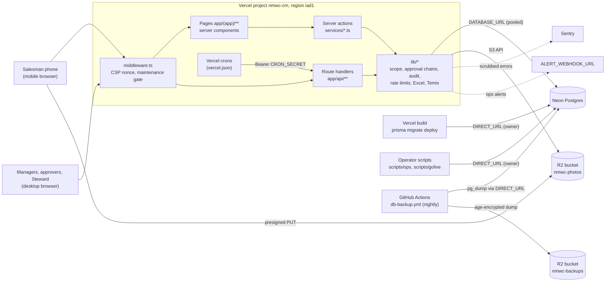
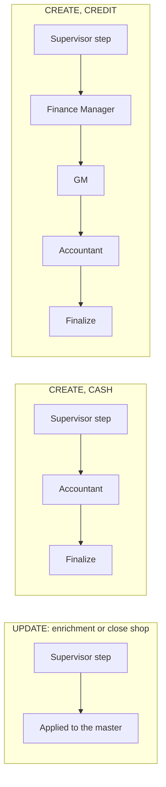
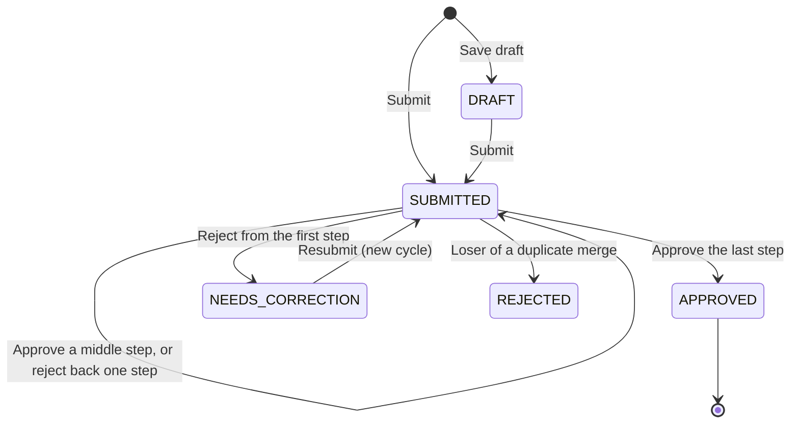
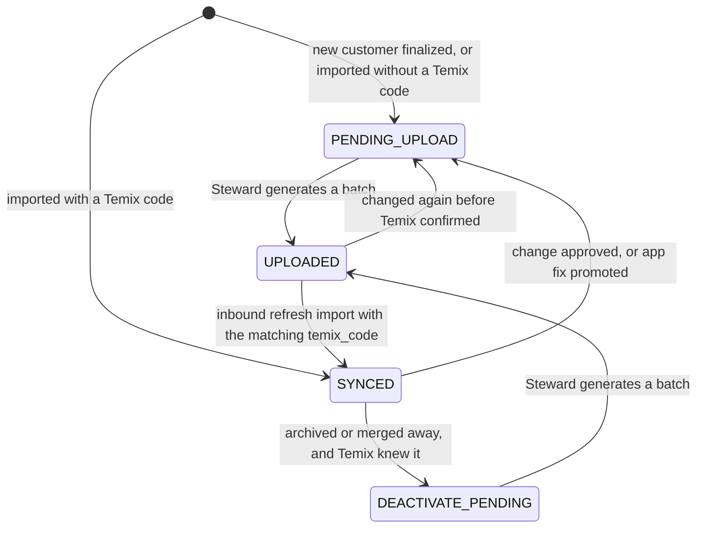
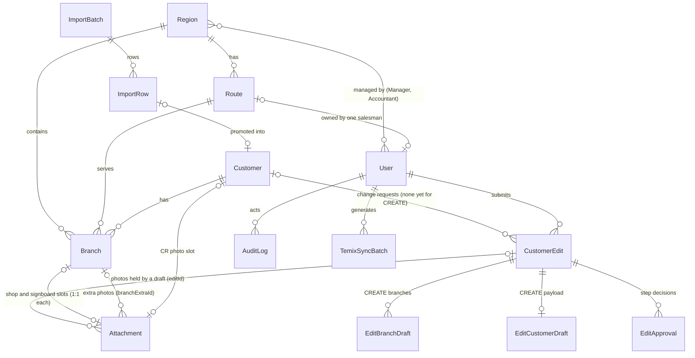

# 01 — System overview: what NMWC CRM does and how it is built

- **Audience:** a developer or operator who has never seen this project.
- **Code described:** `main` at `9d0fd61` (2026-10-04).
- **This file is public.** It names things and never holds a value. The local `.env`
  files, customer data, generated passwords, backups and the Claude Code chat history
  are in the private handover pack (PRIVATE-HANDOVER.md), which is handed over offline.
  A few things are in neither the repository nor the pack; section 6 lists them.
- **Other handover files:** start at
  [`HANDOVER-START-HERE.md`](../../HANDOVER-START-HERE.md). The eight numbered files in
  [`docs/handover/`](./), 01 to [08 — the knowledge graph](08-KNOWLEDGE-GRAPH.md), are
  listed in reading order in section 7.
- **"The owner"** in this file is the project owner who is handing over. Product and
  business decisions after the handover go to the person the owner names in
  PRIVATE-HANDOVER.md; until someone is named, they stay with the owner.

**When sources disagree, trust them in this order:** the code, then
[`AUDITOR-BRIEF.md`](../../AUDITOR-BRIEF.md), then recent commit messages, then
everything else. Many older files in `docs/` and `qa/` are stale;
[AUDITOR-BRIEF §15](../../AUDITOR-BRIEF.md#15-docs-versus-code--known-contradictions)
lists the known contradictions.

This page is the map. Each section links to the place that has the detail.

---

## Before you touch anything

These four rules protect production. Each has a real incident behind it
([`CLAUDE.md`](../../CLAUDE.md), [`AGENTS.md`](../../AGENTS.md) "Before you start").

1. **If you were given a copy of the owner's working folder, its `.env` points at
   PRODUCTION.** Do not run tests, Prisma, `scripts/qa/run-with-env.mjs` or any script
   in it. Work in your own clone whose `.env` names the UAT database or your own empty
   Postgres. On the owner's computer today, the main checkout's `.env` points at
   production, and operator runs pass it explicitly
   (`NMWC_PROD_ENV_FILE=<that file> node scripts/dev/prod-run.cjs <script>`). For a new
   setup, keep the production env file **outside every checkout** and pass it the same
   way ([03 §7](03-OPERATIONS-AND-DEPLOYMENT.md#7-running-operator-scripts-against-production)).
2. **Before anything that loads `.env`, run `node scripts/dev/env-check.cjs`.** It
   prints only "production" or "not production" for `DATABASE_URL` and `DIRECT_URL`,
   never a value, and exits 1 on production. Never check `.env` with `grep` or
   `Select-String`: they print the whole line, password included.
3. **Never run `npm run build` locally.** It runs `prisma migrate deploy` against
   whatever `.env` names (section 2.5). The same goes for every `npm run db:*` script.
4. **Merging to `main` deploys to production** (section 2.7).

---

## Contents

1. [What the system is for](#1-what-the-system-is-for)
2. [Architecture](#2-architecture)
3. [Roles and what each can do](#3-roles-and-what-each-can-do)
4. [Core flows](#4-core-flows)
5. [Data model essentials](#5-data-model-essentials)
6. [Repository map](#6-repository-map)
7. [Read next](#7-read-next)

---

## 1. What the system is for

- **NMWC** is National Mineral Water Company SAOG, Oman. It sells bottled water
  through field salesmen. Each salesman owns one **route** of shops.
- **NMWC CRM** (the "Customer Master", package name `nmwc-cm`) is a field tool to
  clean up and complete the company's customer master data.
- It **supports** the company ERP, **Temix** (spelled "Timix" in some files). Temix
  stays the system of record. There is no live Temix API: data moves as Excel files
  that a Data Steward uploads and downloads by hand (`lib/temix.ts`,
  `services/temix.ts`).
- **The core loop:**
  1. A salesman opens a customer on his route.
  2. He fills the gaps: phone, contact, address, GPS, photos, channel, visit day,
     equipment counts.
  3. He submits. An approver approves.
  4. The change lands in the master, and the customer is queued for the next Temix
     batch.
- **New customers** go through a multi-step approval chain (cash or credit).
- **The Data Steward** imports the masters, resolves duplicates and runs the Temix
  batches.
- **Language and time:** the UI is English. Business logic runs on Oman time
  (UTC+4, fixed offset). The workweek is Sunday to Thursday, 08:00–17:00
  (`lib/working-hours.ts`, `lib/tz.ts`). Scheduled jobs are written in UTC.
- **Where it runs:** the production app is `https://nmwc-cm.vercel.app`; its health
  endpoint is `/api/health` ([`docs/OPERATIONS.md` §1](../OPERATIONS.md#1-production-url)).

Deeper: [AUDITOR-BRIEF §1](../../AUDITOR-BRIEF.md#1-what-this-system-is) and
[`docs/PROJECT-DESCRIPTION.md`](../PROJECT-DESCRIPTION.md) (business background;
older than the code).

---

## 2. Architecture

### 2.1 The picture



### 2.2 The stack

| Layer | What | Where |
|---|---|---|
| Web app | Next.js 15.5 App Router, React 19, TypeScript, Tailwind 3.4. Server components and server actions. `typedRoutes` is on. | `app/`, `components/nmwc/`, `next.config.ts` |
| Server logic | `'use server'` modules export the server actions. Shared domain and infrastructure code lives in `lib/`. | `services/*.ts`, `lib/*.ts` |
| HTTP routes | 16 route handlers: auth, field-form submits, photos, exports, health, crons, ops, a perf probe. | `app/api/**/route.ts` |
| Auth | next-auth 5 (beta.32), Credentials provider, JWT sessions of 8 hours, `__Host-` cookie. | `auth.config.ts`, `lib/auth.ts`, `lib/session.ts`, `middleware.ts` |
| Database | Prisma 6 on PostgreSQL hosted by Neon. 24 models, 23 migrations. | `prisma/schema.prisma`, `prisma/migrations/`, `lib/db.ts` |
| Files | Cloudflare R2, two buckets: `nmwc-photos` (photos and documents) and `nmwc-backups` (encrypted nightly database dumps). Separate credentials per bucket. | `lib/r2.ts`, `.github/workflows/db-backup.yml` |
| Hosting | Vercel Pro, functions in region `iad1`, `maxDuration` 60 s. | `vercel.json` |
| Scheduled jobs | Four Vercel crons, plus GitHub Actions workflows for backups, the restore drill and R2 checks. | `vercel.json`, `.github/workflows/` |
| Errors and logs | Sentry on all three runtimes, with scrubbers. Structured logs through pino, scrubbed of phones, e-mails and digit runs. No source-map upload. | `sentry.*.config.ts`, `instrumentation*.ts`, `lib/sentry-scrub.ts`, `lib/logger.ts`, `lib/scrub.ts` |
| Excel | exceljs 4.4: import parsing and a streaming writer for exports. | `lib/excel.ts` |

**Dependency debt to plan for.** `npm audit --omit=dev` is gated at critical in CI.
Four high and three moderate findings are open; fixing them needs Next 16, Prisma 7
and an exceljs change
([AUDITOR-BRIEF §8](../../AUDITOR-BRIEF.md#8-security-controls), "Secrets hygiene").

Deeper: [AUDITOR-BRIEF §3](../../AUDITOR-BRIEF.md#3-architecture-and-stack) and
[§4](../../AUDITOR-BRIEF.md#4-repository-map-and-entry-points) (every route handler
and its auth rule).

### 2.3 How a request is served

- **Pages** are server components under `app/(app)/`. The `(app)` layout calls
  `auth()` and redirects to `/login` when there is no session
  (`app/(app)/layout.tsx`). Each page then calls `auth()` itself and checks the role it
  needs. There is no central route-to-role table. A page that refuses a role usually
  redirects to `/home`, which sends the user on to his role's landing page
  (`app/(app)/home/page.tsx`, `lib/role-home.ts`).
- **Mutations** are server actions in `services/*.ts`.
- **The three field forms** (update customer, new customer, close/reactivate) do
  **not** call server actions directly. They POST JSON to
  `app/api/forms/[form]/route.ts`, which calls the same action code. The reason: a
  stalled server action cannot be aborted, and every later action queues behind it
  (`lib/submit-client.ts` header). Photo attach and remove go the same way
  (`app/api/photos/attach`, `app/api/photos/detach`).
- **Server actions and route handlers** read the session through `requireActor()` /
  `checkActor()` in `lib/session.ts`. `tests/unit/actor-guard.test.ts` fails if
  anything under `services/`, `app/api/`, `app/actions/` or `lib/` calls `auth()`
  itself (sign-out is the one exception).
- **The middleware does not gate signed-out requests.** Its `authorized: false` result
  is discarded; the reason is explained in `auth.config.ts`. Every surface checks the
  session itself. This is a recorded engineering decision (SEC-01), not an oversight
  ([AUDITOR-BRIEF §8](../../AUDITOR-BRIEF.md#8-security-controls)).

### 2.4 Two database URLs

| Variable | What it is | Used by |
|---|---|---|
| `DATABASE_URL` | The **pooled** connection (a Neon `-pooler` host). By design it is the least-privilege role `nmwc_app`. | The running app (`lib/db.ts`). |
| `DIRECT_URL` | The **owner** connection. | `prisma migrate deploy` during every build, operator scripts, the nightly backup. |

- The least-privilege role is defined and checked by `scripts/ops/app-role.ts`
  (`create`, `grant`, `verify`, `status`).
- Whether production uses the restricted `nmwc_app` role is recorded in
  PRIVATE-HANDOVER.md; switching is an owner-side action
  ([`docs/CREDENTIAL-ROTATION.md`](../CREDENTIAL-ROTATION.md#step-1--move-the-application-off-the-owner-role)).
- Operator scripts build their own Prisma client from `DIRECT_URL` and must not be
  coupled to the request runtime (`CLAUDE.md`, "The code").
- **Never write to the production database by accident.** Its endpoint contains
  `ep-sweet-haze`. Many tests and scripts refuse it, but **not all of them**:
  [AUDITOR-BRIEF §2](../../AUDITOR-BRIEF.md#2-ground-rules-for-you-the-auditor) and
  [§11](../../AUDITOR-BRIEF.md#11-standing-rules-claudemd--and-how-true-they-are-today)
  list the ones that write with no check. Read [`CLAUDE.md`](../../CLAUDE.md) "Safety" and
  [`docs/HANDOVER.md` §5](../HANDOVER.md#5-production-how-to-read-and-write-safely)
  before touching it.
- **Who writes to production.** Operator scripts have been run by Claude Code under a
  production-write grant from the owner, with the safeguards in HANDOVER §5. Codex has no
  production access. The grant ends on the date recorded in PRIVATE-HANDOVER.md; after
  that the new person decides
  ([`docs/HANDOVER.md` §4](../HANDOVER.md#4-the-owners-recorded-decisions), "Operations").

### 2.5 Environments

| Environment | Database | App |
|---|---|---|
| Production | Neon production endpoint | Vercel Production. **Merging to `main` deploys it.** |
| UAT | Neon branch `uat-testing` | Vercel Preview builds from branch pushes. Per the docs, previews run `prisma migrate deploy` against UAT. This is a Vercel setting the repo cannot show. |
| CI | A throwaway `postgres:16` container per job | `.github/workflows/ci.yml` |
| Local | Your own empty Postgres, or UAT. **Never** a `.env` that names production: run `node scripts/dev/env-check.cjs` first. | `npm run dev` |

The build script runs the migration **before** `next build`:

```
prisma generate && next typegen && tsc --noEmit && next lint && prisma migrate deploy && next build --no-lint
```

So a failure inside `next build` lands **after** the schema has changed. CI's
`next build` on the branch is the only early warning. See
[`CLAUDE.md`](../../CLAUDE.md) "Deploying" and
[AUDITOR-BRIEF §10](../../AUDITOR-BRIEF.md#10-deployment-and-operations).

### 2.6 Security controls at a glance

| Control | Where |
|---|---|
| Passwords: bcrypt cost 12. New and reset accounts must change the password at first sign-in (at least 12 characters, not one of the last five). Enforced by the middleware redirect and by `requireActor()` / `checkActor()` in every action and route. | `services/password.ts`, `lib/password-policy.ts`, `auth.config.ts`, `lib/session.ts` |
| Session revocation: `User.sessionsRevokedAt` is bumped on logout (`app/actions/auth.ts`), own password change (`services/password.ts`), admin reset, activate/deactivate and role change (`services/users.ts`), and an account-import password reset or role change (`services/imports.ts`). **It is not instant:** an existing session can live on for up to about 5 minutes ([AUDITOR-BRIEF §5](../../AUDITOR-BRIEF.md#5-domain-roles-and-scope), "Session facts"). | `lib/auth.ts` (reads it) |
| Scope: fails closed. An out-of-scope read returns **404**, not 403. | `lib/access.ts`, `lib/permissions.ts` |
| Content-Security-Policy: a per-request nonce, `strict-dynamic`. **Never reorder the directives.** | `lib/csp.ts`, `middleware.ts`, `tests/unit/csp.test.ts` |
| Other headers: HSTS, nosniff, `X-Frame-Options: DENY`, COOP/CORP. | `next.config.ts` |
| Rate limits: Postgres-backed token buckets (the `RateLimit` table). Sign-in, edit submits, photo presign, imports and Temix batches are limited. | `lib/rate-limit.ts`, `lib/login-throttle.ts` |
| Demo-account denylist, active when `DEMO_ACCOUNTS_DISABLED` is exactly `true`. It refuses sign-in for usernames starting `salesman.` or `supervisor.`, and for the exact names `manager.a`, `manager.b`, `steward`, `viewer` and `admin`. Those five are exact matches, so a name ending in `.steward`, or any other `manager.` name, is allowed. Never relax it; rename the account. | `lib/demo-accounts.ts`, `lib/auth.ts` |
| Machine auth: crons and ops routes need `Bearer CRON_SECRET`. Detailed health needs `HEALTH_BEARER`. | `lib/cron-auth.ts`, `app/api/health/route.ts` |
| Maintenance mode: `MAINTENANCE_MODE=on` serves a bilingual 503, with a bypass cookie for the operator. | `lib/maintenance.ts`, `middleware.ts` |
| Append-only audit: database triggers stop UPDATE, DELETE and TRUNCATE on `AuditLog` and `EditApproval`. | migrations `20260914150000_audit_immutability`, `20260914160000_audit_maintenance_owner_only` |

The full rate-limit table and the known weaknesses are in
[AUDITOR-BRIEF §8](../../AUDITOR-BRIEF.md#8-security-controls). Every environment
variable name, what it does and what must match it is in
[`docs/SECRETS-INVENTORY.md`](../SECRETS-INVENTORY.md). Where the values are:

- **Values held in the local env files** are in the private handover pack
  (PRIVATE-HANDOVER.md). The production files (the main checkout's `.env` and
  `.env.local`) hold `DATABASE_URL`, `DIRECT_URL`, `LOG_LEVEL`, `NEXTAUTH_SECRET`,
  `NEXTAUTH_URL`, `NEXT_PUBLIC_SENTRY_DSN`, `NODE_ENV`, `R2_ACCESS_KEY_ID`,
  `R2_ACCOUNT_ID`, `R2_BUCKET`, `R2_PUBLIC_BASE`, `R2_SECRET_ACCESS_KEY`,
  `SEED_ADMIN_PASSWORD`, `SENTRY_AUTH_TOKEN`, `SENTRY_ORG` and `SENTRY_PROJECT`. The
  UAT file (a worktree's `.env`) holds the same names plus `AUTH_TRUST_HOST`, minus
  `NEXT_PUBLIC_SENTRY_DSN`.
- **Values that are in no local env file** (apart from the few `PRIVATE-HANDOVER.md` lists as kept elsewhere in the pack) live only in Vercel and GitHub: among them
  `CRON_SECRET`, `HEALTH_BEARER`, `MAINTENANCE_BYPASS_TOKEN`, the `BACKUP_AGE_*` values
  and the other Vercel- or GitHub-only values. Vercel sensitive variables and GitHub
  secrets cannot be read back, so if no copy exists elsewhere they must be regenerated
  (a rotation) by whoever holds those accounts
  ([02 §3](02-ACCESS-ACCOUNTS-AND-SECRETS.md#3-local-env-files)).

**Credentials already in the public repository.** Some committed files hold known
password literals (seed, demo, pilot and a shared initial value) and staff names.
[AUDITOR-BRIEF §14](../../AUDITOR-BRIEF.md#14-sensitive-material-in-the-repository)
lists each file without the values. When and how to rotate is in
[`docs/CREDENTIAL-ROTATION.md`](../CREDENTIAL-ROTATION.md). Rotation status is in
PRIVATE-HANDOVER.md, never in this repo.

### 2.7 Who changes `main`

- **Merging to `main` deploys to production.** CI does not deploy; the Vercel–GitHub
  integration does, and nothing makes Vercel wait for CI.
- **The owner approves every merge, in words ("merge it").** Two ways of carrying out an
  approved merge are recorded:
  - **What has been used since 2026-10-01:** Claude executes the approved merge by
    pushing the exact CI-green commit to `main`. `scripts/dev/ci-watch-sha.sh` confirms
    CI on that SHA, `scripts/dev/build-id.cjs` and `npm run smoke` take the production
    baseline, `git push origin <sha>:refs/heads/main` moves `main`, and
    `scripts/dev/deploy-watch.sh` waits for production to serve the new build, smokes
    it and waits for `main`'s CI on that commit. The full procedure and its gates are
    in [03 §4](03-OPERATIONS-AND-DEPLOYMENT.md#4-deploying-moving-main).
  - **The alternative** recorded in
    [`docs/HANDOVER.md` §2](../HANDOVER.md#2-how-a-change-is-made-verified-and-merged-here)
    and the [`AGENTS.md`](../../AGENTS.md) preface: the owner uses GitHub's **Rebase and
    merge** after CI is green on the PR's latest commit.
- Codex builds on `codex/*` branches and never merges or pushes `main`. Claude reviews
  the risky (Tier B) changes.
- **After the handover**, who approves merges is for the owner and the new person to
  agree; it is on the fill-in list in PRIVATE-HANDOVER.md.
- **GitHub branch protection is not available on the current plan**
  ([AUDITOR-BRIEF §10](../../AUDITOR-BRIEF.md#10-deployment-and-operations)). The gate
  is discipline, not a setting.
- Run `npm run smoke` before and after any production change.
- **Rolling back.** Production runs `main` as of the handover. If a production
  deployment is faulty, use Vercel's Instant Rollback to the previous production
  deployment; the last code batches contain no database migration. An Instant Rollback
  never undoes a migration ([03 §6](03-OPERATIONS-AND-DEPLOYMENT.md#6-rolling-back)).

---

## 3. Roles and what each can do

There are eight roles (the `Role` enum in `prisma/schema.prisma`). Checks live in
`lib/permissions.ts` and `lib/access.ts`. The landing page per role is
`lib/role-home.ts`; the menu per role is `NAV_BY_ROLE` in
`components/nmwc/Sidebar.tsx`.

| Role | Sees | Lands on | Can do |
|---|---|---|---|
| `SALESMAN` | His own route only | `/today` | Enrich customers on his route (update requests). The **only** role that starts a new-customer request, a close-shop request or a reactivation request. Uploads and attaches photos he captured. `legalName` is always locked for him; `crNumber` is locked on CREDIT customers. |
| `SUPERVISOR` | His direct reports' routes | `/approvals` | Approves the **Supervisor step** for his reports. Sees "My team". Exports his team's routes. Cannot edit customers. |
| `MANAGER` | His managed regions | `/dashboard` | **Direct write**: his edits apply at once, with no approval (audited). Acts as the **fallback approver on the Supervisor step** for any request whose branches overlap his regions. The **only** role that decides reactivations. Archives a customer when every live branch is in his regions. Administers `SALESMAN` and `SUPERVISOR` accounts, and routes, in his regions. Exports, reads the audit log and the Service status page. |
| `STEWARD` (Data Steward) | Everything | `/import` | Imports, duplicates and merge, Temix batches, direct write, archive. Creates regions and routes. Administers every role. Exports, audit log, Service status. |
| `ACCOUNTANT` | His managed regions | `/approvals` | The **final step** of both new-customer chains (cash and credit). |
| `FINANCE_MANAGER` | Everything (read) | `/approvals` | A step on the **credit** new-customer chain only. Approves or rejects the requested credit figures; never amends them. |
| `GM` | Everything (read) | `/approvals` | A step on the **credit** new-customer chain only, after the Finance Manager. Always required. |
| `VIEWER` | Everything (read) | `/dashboard` | Read and export org-wide, including CR and guarantee documents. Cannot edit. |

**How the Supervisor step really works.** The design lets regional Managers supervise
salesmen directly, so `SUPERVISOR` accounts are optional (comment in
`components/nmwc/Sidebar.tsx`). A request waiting on the Supervisor step can be decided
by the submitter's direct supervisor (`User.supervisorId`, which may be a Manager) **or**
by any active Manager whose regions overlap the request's branches (`canActOnStep` and
`canApproveSpecificEdit` in `lib/permissions.ts`). Only the direct supervisor is
**notified**; fallback Managers act from their queue (`lib/notifications.ts`). The one
exception (F1): a close-shop request whose supervisor cannot act on it notifies the
region's active Managers instead (`lib/notify-hierarchy.ts`).

**Rules that apply to every role:**

- **Separation of duty.** The submitter never acts on his own request. No user acts on
  two different steps of one request in the same cycle (`canActOnStep`).
- **Scope works at two levels.** A customer is visible when **any** of its live branches
  is in scope. Each screen must then narrow the **branches** itself. Customer-level
  fields (phone, contact, CR, channel) are shared by every branch.
- **Who administers whom.** A Manager may only create or change `SALESMAN` and
  `SUPERVISOR` accounts (`MANAGER_ADMINISTRABLE_ROLES`). The Steward may provision any
  role (`administrableRolesFor`). The account import can neither create nor change a
  `MANAGER` or `STEWARD`: `services/imports.ts` refuses it, and `lib/account-import.ts`
  holds the message. The first Steward and the Managers of a fresh database come from
  `scripts/golive/bootstrap-accounts.ts`.
- **Keep at least two Data Steward accounts.** The current state is in
  PRIVATE-HANDOVER.md. When a Steward account is created, pick a username the
  demo-account denylist does not block (section 2.6).

Deeper: [AUDITOR-BRIEF §5](../../AUDITOR-BRIEF.md#5-domain-roles-and-scope), and
[§12](../../AUDITOR-BRIEF.md#12-deliberate-choices-that-look-like-bugs) for the
choices that look like bugs but were deliberate (for example, Manager direct write
skipping approval, an owner decision). Viewer's org-wide access to CR and guarantee
documents is "by design" in `lib/access.ts`; no owner confirmation of it is recorded.

---

## 4. Core flows

Detail for every flow is in
[AUDITOR-BRIEF §6](../../AUDITOR-BRIEF.md#6-domain-the-flows). This section is the
short version, with the files to open.

### 4.1 Customer enrichment: edit and approval (UPDATE)

**Files:** `app/(app)/customers/[id]/edit/EnrichmentForm.tsx`, `services/edits.ts`,
`lib/enrichment-patch.ts`, `lib/submit-gate.ts`, `lib/decision-token.ts`,
`app/(app)/approvals/`.

1. The salesman edits a customer and its branches. The form sends **only the fields he
   changed**, each with the value it was based on.
2. If a field changed on the server since the form opened, it is refused field by
   field (`STALE_FIELDS`). He chooses "Keep mine" or "Use this value" per field.
3. **Submit gate** (salesmen only, drafts exempt). The default `CORE` gate needs
   channel, phone, contact, an address of at least 3 characters, GPS and a shop photo.
   `SALESMAN_SUBMIT_GATE=FULL` adds more fields.
4. The request is one `CustomerEdit` row. Its `fieldChanges` holds before and after
   for each field. Only **one `SUBMITTED` request per customer, and per branch**, is
   allowed (partial unique indexes `CustomerEdit_open_per_customer` and
   `CustomerEdit_open_per_branch`, `WHERE state = 'SUBMITTED'`). Drafts and requests
   waiting for correction are not limited by them.
5. Every submit carries a `submissionId` minted on the phone. A retry of a submit that
   already landed writes nothing and gets a receipt (`lib/submission-replay.ts`).
6. **Photos are not held for approval.** A photo taken in the edit form goes into the
   live slot at once.
7. The approver decides from `/approvals`: one at a time on `/approvals/[id]`, or in
   bulk (at most 50 per call, `lib/bulk-run.ts`). Each decision carries a **decision
   token** for the exact row the page showed; a changed row is refused as
   `STALE_VIEW`.
8. On approval, the mandatory fields are re-checked against the live record, the
   changes are applied under an optimistic `version` lock, and the customer is
   re-queued for Temix (`PENDING_UPLOAD`).
9. A reject sends the request back to the salesman as `NEEDS_CORRECTION`. He sees it
   under "Needs correction" (`/rejected`).

A **Manager or Steward direct write** skips steps 3 and 7: it applies at once and is
audited with a `direct-write:` reason.

### 4.2 New customer: the cash and credit chains (CREATE)

**Files:** `app/(app)/customers/new/CreateCustomerForm.tsx`, `services/creates.ts`,
`lib/create-guards.ts`, `lib/create-finalize.ts`, `lib/approval-chains.ts`,
`lib/validation/create.ts`.

- Only a salesman starts one. Every branch is forced onto his own route.
- The proposed customer lives in `EditCustomerDraft` and `EditBranchDraft` rows until it
  is approved. Its photos are held by `Attachment.editId`.
- **Hard duplicate blocks at submit:** the same normalised CR number, or the same
  "exact triple" (legal name key + normalised phone + a shared region). Checked against
  live customers **and** other open new-customer requests.
- The CREATE rules always require sub-channel, CR number and photo, visit day and
  signboard.
- The approval chain is chosen by payment terms and **frozen onto the request** at
  submit (`resolveChain`):



- **Reject** steps back one step. From the first step it goes to `NEEDS_CORRECTION`. A
  second reject by the same step in one cycle goes straight to `NEEDS_CORRECTION`. A
  resubmission starts a new cycle.
- **Finalize** (at the last approval): re-checks duplicates, allocates a code
  `NMWC-YYYY-NNNNNN` (the `CodeSequence` table), creates the `Customer` and its
  `Branch` rows, binds the photos, copies the requested credit figures unchanged, and
  queues the customer for Temix.

The states a request moves through (`EditState`):



`REJECTED` is written in one place only: a duplicate merge auto-rejects the losing
customer's open request (`services/duplicates.ts`).

### 4.3 Close a shop and reactivate it

**Files:** `services/reactivations.ts`, `components/nmwc/BranchStatusActions.tsx`,
`app/(app)/reactivations/`, `lib/status-evidence.ts`.

- **Close:** a salesman sends a fresh photo (at most 24 hours old, taken by him, after
  the branch's last status change, attached to that branch) and a reason of at least 5
  characters. The request goes to the Supervisor step queue.
- **Reactivate:** same evidence rules. A **Manager** decides it on `/reactivations`;
  the reject button is labelled "Keep closed".
- At decision time the evidence photo must still be live and wired to that branch, or
  the decision is refused (`EVIDENCE_GONE`) and nothing changes.
- A Manager or Steward direct write can flip a **branch** between CLOSED/SUSPENDED and
  ACTIVE with no photo.

### 4.4 Archive

`archiveCustomerAction` in `services/customers.ts`. The Steward, or a Manager when every
live branch is in his regions, can archive a customer. Archive is a soft delete
(`deletedAt`). There is **no central soft-delete filter**: each query handles
`deletedAt` itself. If Temix knew the customer, archive queues its deactivation.

### 4.5 Photos to R2

**Files:** `app/api/photos/presign`, `app/api/photos/finalize`, `app/api/photos/attach`,
`app/api/photos/detach`, `app/api/photos/[id]`, `services/photos.ts`, `lib/r2.ts`,
`lib/photo-mime.ts`, `components/nmwc/PhotoCaptureSlot.tsx`.

1. **Presign:** the server issues a short-lived upload URL. Declared type must be
   jpeg, png or webp, at most 3 MB.
2. **PUT:** the phone uploads straight to the `nmwc-photos` bucket.
3. **Finalize:** the server checks the object in R2, re-checks the size and takes the
   capture time from R2.
4. **Attach:** the photo is wired to a slot. Kinds (`AttachmentKind`): `SHOP`,
   `SIGNBOARD`, `CR`, `GUARANTEE`, `FREE`.

- Only `SALESMAN`, `STEWARD` and `MANAGER` may upload (`PHOTO_WRITER_ROLES`). A
  `GUARANTEE` document is for a salesman's new-customer request only.
- Photos are **served only** through `app/api/photos/[id]`, after a scope check.
- Removing a photo soft-deletes it. The `photo-gc` cron processes rows soft-deleted
  more than 30 days ago.
- Photos held by an abandoned new-customer draft are never swept; a sweep needs an
  owner-chosen period first (comment on `Attachment.editId` in `prisma/schema.prisma`).
- **Open item: photo cleanup and recovery (finding F02).** `photo-gc` relies on R2
  object tags and lifecycle expiry, and photo recovery was planned on bucket
  versioning. **Cloudflare R2 supports neither object versioning nor object tagging**
  ([`docs/HANDOVER.md` §6.1](../HANDOVER.md#61-waiting-on-the-owners-decision), F02;
  [AUDITOR-BRIEF §6](../../AUDITOR-BRIEF.md#6-domain-the-flows), "Photos"), so the
  design has to change. The recommendation and the owner decision it waits on are in
  HANDOVER §6.1. Until then, each photo has a single copy.
  [`docs/OPERATIONS.md` §6.13](../OPERATIONS.md#613-photographs--bucket-versioning-owner-cloudflare-dashboard)
  is stale on this point: it treats versioning as a Cloudflare dashboard setting the
  owner can turn on. Current status:
  [AUDITOR-BRIEF §18](../../AUDITOR-BRIEF.md#18-known-gaps-and-open-items).
- **Do not run `npm run ops:r2-setup`** (`scripts/r2-setup-lifecycle.ts`) against the
  production photo bucket. It **replaces the bucket's whole lifecycle configuration**
  and deletes any rule added in the dashboard
  ([`docs/OPERATIONS.md` §6.13](../OPERATIONS.md#613-photographs--bucket-versioning-owner-cloudflare-dashboard),
  step 0).

### 4.6 GPS

- `components/nmwc/GpsCaptureButton.tsx` uses the browser's geolocation (high
  accuracy, 15-second timeout, no cached fix). It stores latitude, longitude, accuracy
  and capture time on the branch.
- The location is sent and judged as **one value** (both coordinates together).
- When the phone cannot get a fix, the salesman may type a point and must give a
  reason. The point is flagged inside the request's `fieldChanges`
  (`lib/gps-manual.ts`, item 41). The flag is not visible on the branch after approval.
- The database enforces valid GPS ranges with CHECK constraints.

### 4.7 Today and visit days

- `app/(app)/today/page.tsx` lists the salesman's branches whose visit day
  (`Branch.dayOfVisit`, `SAT` to `FRI`) equals **today's Oman day**. It shows 200 rows a
  page with Previous/Next.
- `/today?view=no-day` lists his route's live branches that have **no** visit day yet.
- There is no status filter, so closed branches are listed too.
- Visit days arrive through the customer-master import. Days that an import quarantine
  held back can be landed by `scripts/ops/apply-quarantined-visit-days.ts`
  (`npm run ops:visit-days`, an owner-run operator script; see
  [`docs/OPERATIONS.md` §7](../OPERATIONS.md#7-common-operations)).
- **The per-region visit-day sheets** (lists of branches with no visit day, sent to each
  region to fill in) are loaded by `scripts/ops/visitdays-from-sheets.ts`
  (`npm run ops:visitdays-from-sheets`, an owner-run operator script) on the dry run →
  independent check → rehearsal → apply pattern, with `--reverse` to undo a run. It writes
  only ACTIVE branches that still have no day, and lists the rows that need a person
  (a note, an unknown day, a branch that moved, closed or already has another day, rows
  that disagree) in a private review workbook. See
  [03 §7.6](03-OPERATIONS-AND-DEPLOYMENT.md#76-scripts-that-read-or-write-a-database) and
  [04 D2](04-PENDING-WORK.md#d2-filling-in-missing-visit-days--p1).

### 4.8 Imports (Steward only)

**Files:** `app/(app)/import/`, `services/imports.ts`, `services/import-fixes.ts`,
`lib/import-row-check.ts`, `lib/import-row-fix.ts`, `lib/excel.ts`. Templates:
[`docs/import-templates/`](../import-templates/).

- **Two kinds** (`ImportBatch.kind`): the **account master** (regions, routes, users)
  and the **customer master**.
- Each row has a state (`ImportRowState`). It starts as `PENDING`. Parsing makes it
  `CLEAN`, `QUARANTINED` (held back) or `REJECTED`. It becomes `PROMOTED` once written.
- **Promote** runs in time-boxed, leased slices and can be resumed, because a full
  master cannot be written inside the 60-second function limit.
- Each row takes a **lane**: the ordinary upsert; the **refresh lane** (only when the
  stored Temix code equals the row's `temix_code`; it flips `UPLOADED` to `SYNCED`); or
  **branch only**, for a row the Steward fixed in the app **when the customer is linked
  to Temix**. A fixed row for a customer not linked to Temix takes the ordinary or
  refresh lane (`branchOnlyNote` in `lib/import-row-fix.ts`).
- The batch page offers in-app fixes: re-check, correct, release, exclude, include,
  withdraw.
- Row payloads are swept after 90 days (`IMPORT_PAYLOAD_DAYS`).

The lane rules are subtle and have many owner decisions behind them. Read
[AUDITOR-BRIEF §6](../../AUDITOR-BRIEF.md#6-domain-the-flows) ("Imports") and
[`docs/OPERATIONS.md` §7](../OPERATIONS.md#7-common-operations) before changing them.

### 4.9 Exports

| Export | Route or action | Notes |
|---|---|---|
| Customer master | `app/api/exports/customers` → `services/exports.ts` | Streaming xlsx, keyset pages, ceiling 60,000 rows. |
| Field-update report | `app/api/exports/changes` → `lib/change-report.ts` | Same ceiling. |
| "Export filtered" on `/customers` | `services/customer-export.ts` | Capped at 5,000 rows. |
| Temix batch re-download | `services/temix.ts` | Rate-limited. |

- Export roles: `MANAGER`, `STEWARD`, `VIEWER`, `SUPERVISOR` (`canExport`). The role's
  scope is intersected with the user's filters, never replaced.
- Every workbook-building export writes an `EXPORT` audit row
  (`tests/unit/export-audit-guard.test.ts`).
- Exports are **never stored** on the server.
- An export is **not** an import file. Re-uploading one could reopen closed branches.

### 4.10 Temix (ERP) sync batches (Steward only)

**Files:** `app/(app)/temix/`, `services/temix.ts`, `lib/temix.ts`.

Each customer carries a `temixSyncState`:



Two details the diagram leaves out. Archive and merge move a customer to
`DEACTIVATE_PENDING` from **any** state when Temix knew it, and park it at `SYNCED`
when Temix never knew it or a live customer still holds its code (`lib/temix.ts`
`resolveArchiveTemixState`, finding F11). A deactivation row reaches `SYNCED` through
"Mark loaded" (step 3 below), not through the refresh import.

1. **Generate:** the whole queue goes into one `TemixSyncBatch`, and the Steward
   downloads an xlsx. Above 5,000 rows generation is refused; there is no in-app split.
2. The Steward loads the file into Temix by hand.
3. **Mark loaded:** settles only the **deactivation** rows to `SYNCED`. Live rows stay
   `UPLOADED` until a Temix master export is imported back through the refresh lane.

The exact Temix file format is still to be confirmed with Temix (owner decision D4;
[AUDITOR-BRIEF §18](../../AUDITOR-BRIEF.md#18-known-gaps-and-open-items)).

### 4.11 Duplicates and merge (Steward only)

**Files:** `app/(app)/duplicates/`, `services/duplicates.ts`, `lib/duplicate-pairing.ts`,
`lib/name-key.ts`.

- Matching is **exact only**: the same normalised CR, or the same exact triple. Fuzzy
  and phone-only matching were dropped by the owner.
- Pairs are computed when the page opens. It shows the true pair count and the first 50.
- "Mark distinct" stores a dismissal as an `AuditLog` row (`entityType` `CustomerPair`).
- **Merge** locks both customers, moves branches, requests and photos to the winner,
  soft-deletes the loser, auto-rejects the loser's open request and, if Temix knew the
  loser, queues its Temix deactivation.

### 4.12 Users, routes and regions

- `/users` (`services/users.ts`): create, activate/deactivate, reset password, change
  role. The Users page shows whether an active account has signed in and whether its
  password change is pending.
- A deactivation or reset ends the user's existing sessions within about 5 minutes,
  not at once (section 2.6). Allow for that in day-1 support
  ([`docs/OPERATIONS.md` §7a](../OPERATIONS.md#7a-day-1-support--symptom--action)).
- `/routes` (`services/routes.ts`): only the Steward creates regions. A Manager (inside
  his regions) or the Steward administers routes. Each route belongs to one region. A
  branch's region must equal its route's region (a database trigger,
  `branch_region_consistency_check`).
- A salesman owns exactly one route (`User.ownedRouteId` is unique).

### 4.13 Audit

- Every audit row goes through `writeAudit()` in `lib/audit.ts`. An ESLint rule bans
  direct writes in `app`, `components`, `lib` and `services`;
  `tests/unit/audit-guard.test.ts` proves the rule still fires.
- `AuditLog` and `EditApproval` are append-only, enforced by database triggers.
- System actions are attributed to a real user with a `system:` reason.
- The `/audit` page is for `MANAGER` and `STEWARD`.

### 4.14 Notifications (in-app, and e-mail once switched on)

- Rows in `Notification`, shown on `/notifications` (`lib/notifications.ts`,
  `services/notifications-actions.ts`). Where each row links is `lib/notification-links.ts`:
  anything about a reactivation takes a Manager to `/reactivations`, the only page that
  decides one.
- **E-mail (F1, 2026-10-05), off until `NOTIFY_EMAIL_ENABLED=on`.** The `Notification`
  table is the outbox (`emailedAt`, `emailStatus`, `emailAttempts`, `emailLeaseUntil`;
  every row that existed before the feature is marked `PRE_FEATURE` and is never e-mailed).
  `/api/cron/email-drain` (every 10 minutes, 03:00–14:59 UTC) sends each recipient one
  plain-text digest from the owner's Gmail: counts, request kinds and links, never a
  customer, salesman or route name. Only Managers, Supervisors, Accountants and the
  Finance Manager are e-mailed — never the GM, a Steward, a Viewer or a salesman — and
  only about a row not yet read whose request still waits on them. Caps: one digest per
  person per 30 minutes, 40 per run, 400 a day. Off production it sends only to a redirect
  inbox. Runbook: [OPERATIONS §5i](../OPERATIONS.md). Defaults: `lib/notify-policy.ts`.
- `/approvals/[id]` says, in a banner, when its viewer cannot decide the current step or
  the request is a reactivation (`lib/decision-lane.ts`).
- Addresses: the Steward sets or clears an account's e-mail on `/users`; the page shows
  only an "E-mail on file" badge. `scripts/ops/notify-readiness.ts` counts the gaps
  (read-only).
- Who is told when a request reaches a step (`resolveStepAudience`):
  - the Supervisor step → the submitter's direct supervisor only;
  - the Accountant step → active Accountants whose regions overlap the request;
  - the Finance Manager and GM steps → every active holder of the role.
- Who is told at the final approval (`services/edits.ts`):
  - an **UPDATE** (enrichment or close shop) → the submitter only;
  - a **CREATE** (new customer) → the submitter, plus every active Steward ("Ready for
    Temix upload").
- **When a salesman submits** (F1, 2026-10-05; `lib/notify-hierarchy.ts`, defaults in
  `lib/notify-policy.ts`): update and new-customer requests notify the supervisor as
  above; a close-shop request notifies his supervisor if that supervisor can act on it,
  else every active Manager of the branch's region; a reactivation request notifies his
  supervisor if he is an active Manager of the region, else every active Manager of it
  (`REACTIVATION_REQUESTED`, linked to `/reactivations`). Every salesman request also
  tells the region's active Accountant, for information (`REQUEST_FYI`). Never the GM,
  the Steward, a Viewer or a salesman. Photo uploads notify nobody.
- A reject → the submitter. An SLA breach → the escalation targets (section 4.15).
- Bodies carry only the legal name, the customer code and a link. Never a phone or CR
  number.

### 4.15 SLA escalation and the other scheduled jobs

**Vercel crons** (`vercel.json`; times are UTC, every day including weekends):

| Job | Schedule (UTC) | What it does |
|---|---|---|
| `/api/cron/sla-escalate` | :15 and :45, 03:00–14:59 | Marks approval steps that broke their working-hours budget. Level 1 at the breach, level 2 at twice the budget. Writes `escalationLevel`, an `ESCALATE` audit row, notifications and an alert. **Never changes workflow state.** |
| `/api/cron/keep-warm` | every 4 minutes, 03:00–14:59 | Keeps the function and the database pool warm. Each run is also the availability probe for the service levels. |
| `/api/cron/photo-gc` | 03:00 daily | Processes photos soft-deleted more than 30 days ago (see the F02 item in 4.5). |
| `/api/cron/retention-sweep` | 03:30 daily | Prunes stale rate-limit rows, notifications, cron-run rows and old import payloads, per [`docs/compliance/DATA-RETENTION-SCHEDULE.md`](../compliance/DATA-RETENTION-SCHEDULE.md). Never touches the audit ledgers. |
| `/api/cron/email-drain` | every 10 minutes, 03:00–14:59 | F1: sends the notification e-mail digests (above). Does nothing until `NOTIFY_EMAIL_ENABLED=on`. Warning-tier heartbeat. |

- **SLA budgets:** Supervisor 8 working hours, Accountant 9. The Finance Manager, GM and
  Manager budgets are placeholders (owner question "Q-sla"). The budgets are frozen onto
  each request at submit (`lib/working-hours.ts`, `lib/escalation.ts`).
- **Who receives an escalation** (`escalationPlan` in `lib/escalation.ts`; the chain is
  marked "Open — owner to confirm" in the code):

  | Step that breached | Level 1 | Level 2 adds |
  |---|---|---|
  | Supervisor | Managers of the request's regions (the GM when no Manager covers them) | GM |
  | Manager (reactivation) | GM | Steward |
  | Accountant | Finance Manager and GM | Steward |
  | Finance Manager | GM | Steward |
  | GM | all Managers and the Steward | (same) |

  **The no-Manager fallback:** when no active Manager covers the request's regions,
  `app/api/cron/sla-escalate/route.ts` sends a Supervisor-step breach to the GM, and
  that is what runs. The header comment in `lib/escalation.ts` ("fallback: all active
  MANAGERs") is stale
  ([AUDITOR-BRIEF §15](../../AUDITOR-BRIEF.md#15-docs-versus-code--known-contradictions)).
  The fallback applies only to the region-scoped Supervisor step; a GM-step breach always
  goes to all Managers and the Steward.
- **Heartbeats:** five jobs record one (`CronHeartbeat`, plus one `CronRun` row per run)
  through `lib/heartbeat.ts`: the four Vercel crons and the nightly backup (which reports
  through `/api/ops/backup-report`). The detailed `/api/health` alarms on a failed, stale
  or never-run job.

**GitHub Actions** (`.github/workflows/`):

| Workflow | When | What |
|---|---|---|
| `ci.yml` | every push | Typecheck, lint, unit tests, `next build`, `npm audit` gate, Postgres integration suites, Playwright login test, backup restore chain, secrets scan; on `main`, post-deploy smoke. |
| `db-backup.yml` | 02:00 UTC daily | `pg_dump` → integrity gates → age encryption → `nmwc-backups`; reports to `/api/ops/backup-report`. Decrypting a dump needs the age private key (see below the table). |
| `restore-drill.yml` | 04:00 UTC on the 1st | Monthly restore drill. **It has never succeeded:** its scheduled run on 2026-10-01 failed at preflight because the `NEON_API_KEY` and `NEON_PROJECT_ID` GitHub secrets are missing. See [`docs/OPERATIONS.md` §6.12](../OPERATIONS.md#612-turning-the-restore-drill-on-owner-neon-console). |
| `r2-config.yml` | 05:00 UTC daily | Checks the backup bucket's 30-day expiry and the photo bucket's versioning. It needs R2 admin tokens. The photo half cannot pass as written, because R2 does not support versioning (F02, section 4.5). Current status: [AUDITOR-BRIEF §10](../../AUDITOR-BRIEF.md#10-deployment-and-operations) and [§18](../../AUDITOR-BRIEF.md#18-known-gaps-and-open-items). |
| `keep-warm.yml`, `sla-escalate.yml` | same grid as Vercel | Backup callers of the same endpoints; GitHub's scheduled runs are sparse. Duplicate calls are harmless: the sweep is claim-guarded and idempotent. |
| `cron-scheduler.yml`, `provision-app-role.yml` | manual only | Check or fix the external cron-job.org jobs; provision the `nmwc_app` role (asks for the target endpoint id). |

**The backup decryption key.** The nightly dumps are encrypted to an age key. Its
private identity was **not** found on the owner's computer and is **not** in the
private pack, and GitHub's `BACKUP_AGE_IDENTITY` secret cannot be read back. Without
it, no dump can be decrypted by anyone else. It is the owner's first action before
handing over: put a copy in the pack, or add the new person's age recipient and prove
one decrypt ([02](02-ACCESS-ACCOUNTS-AND-SECRETS.md),
[`docs/OPERATIONS.md` §6.7](../OPERATIONS.md#67-backup-encryption-and-key-escrow)).

An external scheduler (cron-job.org) may still call keep-warm and the SLA sweep until it
is retired
([`docs/OPERATIONS.md` §5d](../OPERATIONS.md#5d-cron-heartbeats-and-the-health-probe-b5-2026-09-14)).

### 4.16 Health, service status and alerts

- `GET /api/health`: anonymous callers get only `{status}`. With `HEALTH_BEARER` it
  returns detail: database, R2, the running commit, every job's heartbeat
  (`lib/health.ts`).
- `/status` (Steward and Manager): service levels against
  [`docs/SERVICE-LEVELS.md`](../SERVICE-LEVELS.md), computed by `lib/service-levels.ts`.
- `lib/alert.ts` posts three event types (`sla.escalated`, `cron.failed`,
  `import.rejections`) to `ALERT_WEBHOOK_URL`. Unset, it does nothing.
- `npm run smoke` (`scripts/ops/smoke.ts`) makes read-only, anonymous checks against
  production. Run it before and after any production change.

---

## 5. Data model essentials

Schema: [`prisma/schema.prisma`](../../prisma/schema.prisma). The diagram shows the
main relations only; some links are plain id columns or JSON (noted in the table).



| Model | What it holds | Key points |
|---|---|---|
| `Region` | A sales region (`code`, `name`). | Managers and Accountants are linked to regions many-to-many (`_ManagerRegions`). |
| `Route` | A salesman's route, inside one region. | `code` is unique. At most one owning user. |
| `User` | Every account, any role. | `username` unique. `ownedRouteId` (salesman, unique), `supervisorId` (hierarchy), `managedRegions`. `mustChangePassword`, `sessionsRevokedAt`. Old hashes in `PasswordHistory`. |
| `Customer` | The legal entity. | `nmwcCode` unique. Legal name, payment terms (`CASH`/`CREDIT`), CR number (+ normalised), channel/sub-channel, phones (+ normalised), contact, status, completeness score, credit limit and term days. Temix crosswalk: `temixCode` (nullable, **not** unique) and `temixSyncState`. `version` for optimistic locking. `deletedAt` for archive. **No unique index on phone or CR** (legacy duplicates; owner decision). |
| `Branch` | A shop of a customer. | `branchCode` unique. Address, area, GPS (lat, lng, accuracy, captured at), visit day, opening hours, delivery window, equipment counts and `equipmentConfirmed`, `shopPhotoId` and `signboardPhotoId` slots (each unique), `extraPhotos`, status, `lastStatusChangeAt`, `version`, `deletedAt`. Region must equal its route's region (trigger). |
| `CustomerEdit` | **Every** change request: update, new customer, close, reactivate. | `process` (`UPDATE`/`CREATE`), `state`, `fieldChanges` (before/after JSON), frozen `approvalChain`, `currentStepIndex`, `pendingRole`, `cycle`, requested credit figures, SLA fields, `submissionId`, `submitGate`. One `SUBMITTED` request per customer and per branch (raw-SQL partial unique indexes). |
| `EditApproval` | One row per step decision. | **Append-only** (trigger). Carries the stage snapshot used by the service levels. |
| `EditCustomerDraft`, `EditBranchDraft` | The proposed customer and branches of a CREATE request. | Turned into real rows at finalize. |
| `Attachment` | A photo or document in R2. | `kind`, `r2Key` unique, `mimeType`, `bytes`, `capturedById`, `capturedAt`, capture GPS, `deletedAt`. Three ways it is linked: the 1:1 slots `Customer.crPhotoId`, `Branch.shopPhotoId` and `Branch.signboardPhotoId` point at it; `branchExtraId` is the one-to-many relation for a branch's extra (`FREE`) photos (`Branch.extraPhotos`); `editId` holds a draft's photos. `customerId` and `branchId` are plain indexed id columns, not relations. |
| `AuditLog` | The forensic record. | `actorId`, `action` (`AuditAction` enum), `entityType`, `entityId`, `before`/`after` JSON, `reason`, ip, user agent. **Append-only** (trigger). Also stores duplicate dismissals and operator-script ledgers. |
| `ImportBatch`, `ImportRow` | One upload and its rows. | `kind` `CUSTOMER` or `ACCOUNT`; promote lease fields. Rows keep `state` (`ImportRowState`, default `PENDING`), `raw`, `parsed`, `issues`, `corrections`, exclusion fields. |
| `TemixSyncBatch` | One outbound Temix batch. | `customerIds` is a **JSON snapshot**, not a relation. `markedLoadedAt` when the Steward confirms. |
| `Notification` | An in-app message, and the e-mail outbox. | `kind` (`NotificationKind`), `readAt`; `emailedAt`, `emailStatus`, `emailAttempts`, `emailLeaseUntil` (`lib/email/`). |
| Others | `Channel`, `SubChannel` (the channel taxonomy), `SavedView`, `RateLimit`, `CronHeartbeat`, `CronRun`, `CodeSequence`, `ExportJob` (unused). | |

**Raw-SQL objects the schema file does not show** (partial unique indexes, trigram
indexes, CHECK constraints, the audit and branch-region triggers) live in the migration
files. `npm run db:migrate` is `prisma migrate dev`: never run it against a real database
without checking for drift. Detail:
[AUDITOR-BRIEF §7](../../AUDITOR-BRIEF.md#7-data-layer). Every column's personal-data
class: [`docs/compliance/PII-INVENTORY.md`](../compliance/PII-INVENTORY.md), generated
from `lib/compliance/pii-classification.ts`.

---

## 6. Repository map

| Path | What lives there |
|---|---|
| `app/(app)/` | The signed-in pages: `home` (redirects to the role's landing page), `today`, `customers` (list, detail, edit, new), `approvals`, `reactivations`, `work`, `rejected`, `team`, `dashboard`, `users`, `routes`, `import`, `export`, `temix`, `duplicates`, `audit`, `status`, `notifications`, `profile`. `layout.tsx` redirects signed-out users to `/login`. |
| `app/(auth)/`, `app/actions/auth.ts` | The sign-in page and the login and logout server actions. |
| `app/api/` | Route handlers: `auth`, `forms/[form]`, `photos/*`, `exports/*`, `health`, `cron/*`, `ops/backup-report`, `perf-probe`. |
| `components/nmwc/` | Shared UI components (photo slot, GPS button, sidebar, cards, modals). |
| `lib/` | Domain and infrastructure: `access`, `permissions`, `session`, `auth`, `audit`, `csp`, `rate-limit`, `approval-chains`, `escalation`, `working-hours`, `submission*`, `excel`, `temix`, `r2`, `heartbeat`, `health`, `logger`, `scrub`. Sub-folders: `validation/` (zod schemas), `ops/` (go-live account and route lists, and `required-secrets.ts`), `compliance/` (PII classification). |
| `services/` | The server actions (`'use server'`): `edits`, `creates`, `photos`, `reactivations`, `imports`, `import-fixes`, `exports`, `customer-export`, `duplicates`, `temix`, `users`, `routes`, `customers`, `password`, `saved-views`, `notifications-actions`. |
| `prisma/` | `schema.prisma`, `migrations/`, the seeds, and **historical one-off scripts that write as soon as they run**. Read [AUDITOR-BRIEF §2](../../AUDITOR-BRIEF.md#2-ground-rules-for-you-the-auditor) before running anything here. |
| `scripts/ops/` | Operator tools: `smoke.ts`, `verify-load.ts`, `app-role.ts`, `restore-verify.ts`, R2 checks (`r2-photos-versioning.ts`), and one-off production fixes (for example `requeue-untracked.ts`, `zero-credit-limits.ts`, `rescore-completeness.ts`, `visitdays-from-sheets.ts`) that take `--expect-host` and write only with `--apply` (`visitdays-from-sheets.ts` also with `--reverse <runId> --confirm`, which undoes one of its own runs). Owner-run; see [`docs/HANDOVER.md` §5](../HANDOVER.md#5-production-how-to-read-and-write-safely). |
| `scripts/golive/` | `build-masters.ts` (builds the go-live master files from the business sources), `bootstrap-accounts.ts`, `audit-accounts.ts`, `verify-credentials.ts`. They read or write `golive-data/`, which is gitignored and private. |
| `scripts/dev/` | Merge-loop and safety helpers: `ci-watch-sha.sh` (waits for CI on an exact commit), `deploy-watch.sh`, `build-id.cjs`, `prod-run.cjs` (runs a script against production without printing the connection string; an operator script copied into a checkout for it as `*.tmp.ts` is gitignored, and is still deleted after use), `env-check.cjs` (is `.env` production?), `leak-check.cjs` (no known password literal in the public docs). See [`docs/HANDOVER.md` §2](../HANDOVER.md#2-how-a-change-is-made-verified-and-merged-here). |
| `scripts/qa/`, `scripts/ci/`, `scripts/compliance/` | `run-with-env.mjs` (loads `.env` for integration runs; no host check), synthetic data, CI's action-worker check (`check-action-workers.ts`), the PII inventory builder (`build-pii-inventory.ts`). |
| `scripts/*.ts` (root) | A mix; check each file's header before running it. **Current tools:** `print-required-secrets.ts` (`npm run ops:print-secrets`, the secret-name checklist that OPERATIONS and the backup workflow point to), `build-import-templates.ts` (regenerates `docs/import-templates/*.xlsx`), `build-role-guides.ts` (`npm run guide:roles`; the role guides in `docs/guide/` are out of date, see the `docs/` row), `guide-html-to-pdf.ts`. **Write with no production check:** `wipe-synthetic-data.ts`, `flatten-customer-branches.ts`, `cleanup-synthetic-test.ts`, `seed-demo-edit.ts`. **Act on the live app or on accounts:** `synthetic-launch-test.ts` (simulates a day of activity against production), `bulk-reset-credentials.ts` (resets passwords behind `CONFIRM_CREDENTIAL_RESET=yes`), `capture-guide-screenshots.ts` and `capture-steward-screenshots.ts` (sign in to the live app). **Do not run on production:** `r2-setup-lifecycle.ts` (`npm run ops:r2-setup`; section 4.5). |
| `tests/unit/` | Vitest + jsdom. Includes the structural `*-guard.test.ts` files: do not delete or loosen them. |
| `tests/integration/` | Postgres-backed suites, each gated by a `RUN_*` flag. **Never point them at production.** |
| `tests/e2e/` | Playwright: `login.spec.ts` runs in CI; `golive-update-flow.spec.ts` needs a live R2 bucket. |
| `tests/support/` | Test helpers (comment stripper, JSX AST, audit purge helper). |
| `docs/` | Runbooks and records. Current: `HANDOVER.md`, `OPERATIONS.md`, `GO-LIVE-RUNBOOK.md`, `SECRETS-INVENTORY.md`, `CREDENTIAL-ROTATION.md`, `SERVICE-LEVELS.md`, `compliance/`, `import-templates/`, `design/phase2-edit-semantics/`, and this `handover/` set. Role guides (HTML/PDF) in `guide/` are **stale**. A newer English and Arabic guide set (PDFs for the Salesman, Manager, Approvers and Data Steward, a how-it-works guide, and an owner checklist) was produced on 2026-10-04 from the code and given to users; it is in the private pack, not the repository. Whether it replaces `docs/guide/` (after a leak review) is a pending item ([04](04-PENDING-WORK.md)). Many others are historical. |
| `qa/` | Audit evidence, findings and reports, notably `qa/reports/ENTERPRISE-READINESS-ASSESSMENT.md` and `qa/reports/OWNER-DECISIONS.md`. Partly stale. |
| `.github/workflows/` | `ci.yml` and seven operational workflows (section 4.15). |
| `graphify-out/` | A generated knowledge graph of the code and documents, rebuilt on 2026-10-04 from `main` at `9d0fd61`: 4,602 nodes, 10,495 links, 226 clusters. Start at `graphify-out/wiki/index.md` (an article per cluster and per highly connected node); `GRAPH_REPORT.md` is the summary; `graph.html` is the interactive view and needs internet (it loads the vis-network library from unpkg.com); `graph.json` is for tools. Install the tool with `uv tool install graphifyy==0.8.44`. See [08 — the knowledge graph](08-KNOWLEDGE-GRAPH.md). A navigation aid, never a source of truth. |
| Root files | `middleware.ts`, `auth.config.ts`, `next.config.ts`, `vercel.json`, `instrumentation*.ts`, `sentry.*.config.ts`, `playwright.config.ts`, `vitest.config.ts`, `eslint.config.mjs`. Rules: `CLAUDE.md`, `AGENTS.md`. Records: `AUDITOR-BRIEF.md`, `CHANGELOG.md`. `.env.example` lists variable names with placeholder values. `README.md` is stale. |

**Not in the repository, on purpose:** `.env` files, `golive-data/` (customer data and
generated passwords), the go-live source spreadsheets, backups, the operator scripts
used against production, the 2026-10-04 user guides, and the project's chat history.
They are in the private handover pack (PRIVATE-HANDOVER.md), with these exceptions:

- **Values that live only in Vercel and GitHub** cannot be read back, so they are not in
  the pack (section 2.6).
- **The backup decryption key** is not in the pack (section 4.15).
- **Chat history.** The pack holds the app's official exports of all three NMWC CRM chat
  sessions (conversation, sub-agent transcripts, metadata) and the raw Claude Code
  project folders for them (`*.jsonl` transcripts, sub-agent and workflow transcripts,
  tool results). Codex's own history (`~/.codex`, about 4 GB, which also holds the
  owner's personal OpenAI sign-in) is **not** packed; Codex's private notes are in
  `NMWC-Private-Backups`, which is in the pack.

**Opening the pack.** `HOW-TO-OPEN.txt` sits next to it. In Git Bash, macOS or Linux:

```
gpg --output pack.tar.gz --decrypt NMWC-CRM-handover-2026-10-04.tar.gz.gpg && tar -xzf pack.tar.gz
```

Then run `sha256sum -c MANIFEST.sha256` inside the extracted folder. Where each part
goes on a new computer: [05 §5](05-NEW-COMPUTER-SETUP.md#5-open-the-pack-secrets) and
§6.

**Before committing any public document, check it for leaks.** By default
`scripts/dev/leak-check.cjs` checks only `AUDITOR-BRIEF.md`, `AGENTS.md`,
`docs/HANDOVER.md` and `docs/design/**`. Pass other files explicitly, for example
`node scripts/dev/leak-check.cjs docs/handover/*.md` from Git Bash (PowerShell does not
expand `*`), and confirm the "files checked" count it prints. It exits 1 on a leak and
never prints a value.

---

## 7. Read next

**The handover set, in reading order.** Start at
[`HANDOVER-START-HERE.md`](../../HANDOVER-START-HERE.md), then:

1. 01 — System overview (this file)
2. [02 — Access, accounts and secrets](02-ACCESS-ACCOUNTS-AND-SECRETS.md)
3. [03 — Operations and deployment](03-OPERATIONS-AND-DEPLOYMENT.md)
4. [04 — Pending work](04-PENDING-WORK.md)
5. [05 — Setting up a new computer](05-NEW-COMPUTER-SETUP.md)
6. [06 — Working with AI agents](06-WORKING-WITH-AI-AGENTS.md)
7. [07 — Project history](07-PROJECT-HISTORY.md)
8. [08 — The knowledge graph](08-KNOWLEDGE-GRAPH.md)

| You want | Read |
|---|---|
| The rules, each with the incident behind it | [`CLAUDE.md`](../../CLAUDE.md), then the [`AGENTS.md`](../../AGENTS.md) preface |
| How a change is built, checked, reviewed and merged | [03 §4](03-OPERATIONS-AND-DEPLOYMENT.md#4-deploying-moving-main) and [`docs/HANDOVER.md` §2](../HANDOVER.md#2-how-a-change-is-made-verified-and-merged-here) |
| The owner's recorded decisions | [`docs/HANDOVER.md` §4](../HANDOVER.md#4-the-owners-recorded-decisions) and [AUDITOR-BRIEF §12](../../AUDITOR-BRIEF.md#12-deliberate-choices-that-look-like-bugs) |
| What is open | [04 — pending work](04-PENDING-WORK.md), [`docs/HANDOVER.md` §6](../HANDOVER.md#6-what-is-open) and [AUDITOR-BRIEF §18](../../AUDITOR-BRIEF.md#18-known-gaps-and-open-items) |
| Everything in depth, with file references | [`AUDITOR-BRIEF.md`](../../AUDITOR-BRIEF.md); start at [§17 "Where to look first"](../../AUDITOR-BRIEF.md#17-where-to-look-first) |
| How to run it locally | [AUDITOR-BRIEF §16](../../AUDITOR-BRIEF.md#16-how-to-verify-locally), after "Before you touch anything" at the top of this page |
| What the tests really exercise | [AUDITOR-BRIEF §13](../../AUDITOR-BRIEF.md#13-how-the-team-verifies-changes--and-what-the-tests-exercise) |
| Running production: deploy, roll back, backups, incidents, day-1 support | [03 — operations and deployment](03-OPERATIONS-AND-DEPLOYMENT.md) and [`docs/OPERATIONS.md`](../OPERATIONS.md) |
| The go-live load | [`docs/GO-LIVE-RUNBOOK.md`](../GO-LIVE-RUNBOOK.md) |
| Accounts and secrets (names, holders, what must match) | [02 — access, accounts and secrets](02-ACCESS-ACCOUNTS-AND-SECRETS.md), [`docs/SECRETS-INVENTORY.md`](../SECRETS-INVENTORY.md), [`docs/CREDENTIAL-ROTATION.md`](../CREDENTIAL-ROTATION.md), [AUDITOR-BRIEF §14](../../AUDITOR-BRIEF.md#14-sensitive-material-in-the-repository) |
| Terms (Temix, Steward, lane, cycle, EXACT_TRIPLE) | [AUDITOR-BRIEF §19](../../AUDITOR-BRIEF.md#19-glossary) |
| History | [`CHANGELOG.md`](../../CHANGELOG.md) and `git log` (recent commit messages are the design record) |
| Anything private | The private handover pack (PRIVATE-HANDOVER.md); opening it is described at the end of section 6 |
