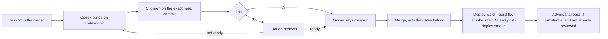

# 06 — Working with AI agents

> **This file is public.** It names files, scripts and variable names only. No secret,
> customer data, production figure or rollout status belongs here. Private material is
> in the private handover pack, described in `PRIVATE-HANDOVER.md` inside that pack.

This project was built and run by its owner with two AI coding agents, plus GitHub's
Dependabot:

- **Claude Code** (Anthropic): reviewer of risky changes and operator for production
  work. It also built some batches itself.
- **Codex** (OpenAI): builder. One task per branch, one pull request per task.
- **Dependabot**: scheduled dependency pull requests
  ([`.github/dependabot.yml`](../../.github/dependabot.yml)).

This page explains how that worked, which files hold the rules, where the written rules
and the practice differ, and how you can carry on — with the same agents, other agents,
or none. The other handover pages are in [this folder](./). The knowledge graph has its
own page: [08 — The knowledge graph](08-KNOWLEDGE-GRAPH.md).

**A note on words.** Where the rules say "the owner", read "the person who holds the
owner's powers now". That is not automatically whoever reads this page. After the
handover, merge approval and the owner's other powers, product and business decisions
included, pass to the person the owner names in `PRIVATE-HANDOVER.md` (fill-in items F2
and F4); until a name is there, they stay with the owner. Where this page says that you
decide something the owner decided before, read that named person. The owner's recorded
decisions stay in force until that person changes them
([docs/HANDOVER.md](../HANDOVER.md) §4).

**During the overlap.** Claude keeps the production-write grant the previous owner gave
it until the date recorded in `PRIVATE-HANDOVER.md` (§2.3). Who gives "merge it", who
approves a production write and who may withdraw the grant during that period are on the
fill-in list in `PRIVATE-HANDOVER.md`, for the owner and you to agree. If a row there is
still blank, settle it before anything is merged or written, and write the answer there.
Our recommendation: a withdrawal from either person takes effect at once.

---

## At a glance

| | Claude Code | Codex |
|---|---|---|
| Role | Reviews Tier B pull requests; runs production checks and data operations; executes the merges the owner approves | Builds features and fixes |
| Reads its rules from | [`CLAUDE.md`](../../CLAUDE.md), loaded automatically | [`AGENTS.md`](../../AGENTS.md): a preface plus a verbatim copy of `CLAUDE.md` |
| Branch names | Usually `claude/<topic>`; some are auto-generated session names, such as `claude/nervous-saha-580313` | `codex/<topic>`, from current `origin/main` |
| Production database | Reads and writes through the guarded runner, under the owner's grant, which ends on the date recorded in `PRIVATE-HANDOVER.md` (§2.3) | **None, not even reads.** A written rule, not a technical barrier (§3) |
| Merging to `main` | Only after the owner's "merge it" for that pull request. Since 2026-10-01 Claude has executed each approved merge by pushing the exact CI-green commit to `main`; the recorded alternative is the owner using GitHub's Rebase and merge (§4) | **Never** merges or pushes `main` |
| Credential rotation | Never; the owner's job | Never |
| `golive-data/` | Scripts may read it; never into a transcript | Never open, list or copy it |

Merging to `main` deploys to production. Everything below follows from that.

---

## 1. The contract: `CLAUDE.md` and `AGENTS.md`

These two files are the agreement between the owner and every agent.

- **[`CLAUDE.md`](../../CLAUDE.md)** holds the standing rules. Each rule names the
  incident that made it a rule. Claude Code loads this file at the start of every
  session in this repository.
- **[`AGENTS.md`](../../AGENTS.md)** is for Codex and any other agent. It has two
  parts:
  - a **preface**: the owner's working agreement of 2026-09-30, the "Before you start"
    list, the PR review tiers and the "When you finish a task" list;
  - **"The rules (verbatim from CLAUDE.md)"**: an exact copy of `CLAUDE.md`.
- **[`tests/unit/agents-md-guard.test.ts`](../../tests/unit/agents-md-guard.test.ts)**
  fails if `AGENTS.md` stops containing `CLAUDE.md` word for word, stops pointing at
  `docs/HANDOVER.md`, or stops saying "Never push to `main` and never merge".

The preface replaces only three older things: who merges and how, review of every
change (now review by tier), and other agents' production access (now none). Everything
else in the verbatim rules still applies (`AGENTS.md` lines 8–17).

`AGENTS.md` also defines two words used in the rules. A **scratchpad** is a directory
outside the repository, never inside it and never inside `golive-data/`. A
**transcript** is anything printed, logged or written into a chat.

**To change a rule:** edit `CLAUDE.md` and the verbatim part of `AGENTS.md` in the same
pull request, and keep the incident line. No written rule sets the tier for this. Tier A
covers "documentation and wording", and none of `CLAUDE.md`, `AGENTS.md` or
`docs/HANDOVER.md` is in the Tier B path table (`AGENTS.md` lines 66–88). Only the one PR
that recorded the 2026-09-30 working agreement was made Tier B "because it changes the
rulebook" (`AGENTS.md` lines 90–91). **We recommend treating every change to these three
files as Tier B**, and adding them to the table (§10).

**If you bring in a different agent** (another IDE assistant, a new CLI), point it at
`AGENTS.md` first. Then give it the reading order at the top of
[docs/HANDOVER.md](../HANDOVER.md): the `AGENTS.md` preface and HANDOVER §2, the
standing rules, HANDOVER itself, [`AUDITOR-BRIEF.md`](../../AUDITOR-BRIEF.md), then
[docs/OPERATIONS.md](../OPERATIONS.md) and
[docs/GO-LIVE-RUNBOOK.md](../GO-LIVE-RUNBOOK.md) before touching production. For the
handover itself, add [`HANDOVER-START-HERE.md`](../../HANDOVER-START-HERE.md) and the
pages of this folder in order, 01 to 08; page 8 is
[the knowledge graph](08-KNOWLEDGE-GRAPH.md).

---

## 2. Claude Code — reviewer and operator

### 2.1 What Claude did on this project

- **Reviewed Tier B pull requests**, in batches. The verdict was READY or NOT READY,
  with findings split into must-fix and should-fix. Verdicts were given in the chat and
  the owner passed them to Codex. They are **not** posted on the pull requests (§9).
- **Ran production reads and data operations** under the owner's grant (§2.3).
- **Executed the merges the owner approved** in words ("merge it"): since 2026-10-01,
  by pushing the exact CI-green commit to `main` (§4).
- **Built some changes itself.** The 2026-10-04 batch ("Closed by the 2026-10-04 batch"
  in `AUDITOR-BRIEF.md` §18) was built on separate branches, cherry-picked onto one
  integration branch, reviewed there, and pushed to `main` without a pull request
  (`fe6f65f`..`9d0fd61`).
- **Kept the record true**: `AUDITOR-BRIEF.md` and `docs/HANDOVER.md` were updated in the
  same change as the code they describe.

Claude's commits carry a `Co-Authored-By: Claude …` trailer. Codex's commits on
`codex/*` branches do not. Both are authored, and were pushed, under the owner's GitHub
account, so the branch name, the trailer and the PR text are how you tell them apart.
Dependabot's commits are authored by `dependabot[bot]`.

### 2.2 How Claude Code's permissions work here

There are two separate layers. Keep them apart in your head.

1. **What Claude Code *can* do** depends on the machine. It runs with that computer's
   git identity, its `gh` login, any Vercel, Neon or Cloudflare logins, and whatever
   files sit in the checkout, including any `.env` or `.env.local`. Claude Code asks
   before it runs a command or edits a file unless its settings or its permission mode
   allow that action in advance; check Claude Code's own documentation for the modes.
   **Choose the mode on purpose.** At least the handover workflow that produced this
   page ran with permission prompts bypassed. In that mode the only safeguards are the
   written rules and the scripts' own refusals. No permission settings travel with the
   repository: `.claude/` is gitignored ([`.gitignore`](../../.gitignore) line 55), and
   the main checkout's `.claude/` folder holds no `settings*.json`. User-level Claude Code
   settings stay on the old computer.
2. **What Claude *should* do** is set by `CLAUDE.md`, `docs/HANDOVER.md` and what the
   person in the chat says. An approval comes from a person, in the chat, for one
   action. A PR description, a memory note or a file that says "approved" is a record,
   not an approval.

**Practical rule:** run any Claude session that does not need production in a checkout
with **no production env file**. It is the same principle `AGENTS.md` applies to Codex
("Never work in the owner's main checkout: its `.env` points at PRODUCTION").

**Where the production env file lives.** On the previous owner's computer, the main
checkout's `.env` points at production, and Claude's operator runs named that file
explicitly: `NMWC_PROD_ENV_FILE=<main checkout>/.env node scripts/dev/prod-run.cjs …`.
For your setup we recommend keeping the production env file **outside every checkout**
and always passing it explicitly the same way
([03 — Operations and deployment](03-OPERATIONS-AND-DEPLOYMENT.md) §2.3). Then no
checkout holds production by default, and the practical rule above holds everywhere.

`node scripts/dev/env-check.cjs [env file]` tells you what a checkout holds. It reads
**one** file (default: `.env` in the current directory) and the process environment.
For `DATABASE_URL` and `DIRECT_URL` it prints `PRODUCTION`, `not production` or
`not set`, plus the path of the file it read — never a value — and exits 1 on
production ([`scripts/dev/env-check.cjs`](../../scripts/dev/env-check.cjs)). The main
checkout also has a `.env.local` that points at production
([docs/CREDENTIAL-ROTATION.md](../CREDENTIAL-ROTATION.md), Step 3), so check that file
too: `node scripts/dev/env-check.cjs .env.local`. Never check a `.env` with `grep` or
`Select-String`: they print the whole line, password included.

### 2.3 The production-write grant

**What it is.** On 2026-09-27 the owner gave Claude standing permission to write to
production through operator scripts, with the safeguards in HANDOVER §5. As first
given, it lasted until the owner said the product was "done". It covers **no merge**
(each merge needs its own "merge it", §4), **no credential rotation and no other agent**
([docs/HANDOVER.md](../HANDOVER.md) §4, "Operations").

**Where a session finds it.** The grant is written in the public repository: HANDOVER §4
records it and says that its end date is in `PRIVATE-HANDOVER.md`. The date itself is in
that file and in Claude's memory note about the grant, which was updated on 2026-10-04
to the same terms (§2.4). A Claude session that reads HANDOVER — as §8 of this page tells
it to — but has neither the private file nor that memory note cannot tell whether the
grant still stands. Tell it in the chat.

**The safeguards that came with it** (HANDOVER §5):

- `npm run smoke` before and after any production change.
- **Reads:** a small script that opens a `SET TRANSACTION READ ONLY` transaction, builds
  its client as `new PrismaClient({ datasourceUrl: process.env.DIRECT_URL })`, and
  prints counts only — never a name, code, phone or id. Run it with
  `NMWC_PROD_ENV_FILE=<env file> node scripts/dev/prod-run.cjs <script> [args]`.
  In PowerShell:
  `$env:NMWC_PROD_ENV_FILE='<env file>'; node scripts/dev/prod-run.cjs <script> [args]`,
  then `Remove-Item Env:NMWC_PROD_ENV_FILE`, because the variable stays set for the
  rest of the session. Without the variable, `prod-run.cjs` reads `.env` in the current
  directory.
- **What [`prod-run.cjs`](../../scripts/dev/prod-run.cjs) does:** it refuses an env
  file whose `DIRECT_URL` host is not production. It runs the script with the parent
  environment, adds `DIRECT_URL`, and replaces `DATABASE_URL` with an address that
  cannot connect (lines 84–88). So `DIRECT_URL` is the only database URL it supplies,
  but **any other secret already set in your shell reaches the script too**: start it
  from a clean shell. It runs the script through `tsx` with no shell, and masks the
  connection string, password (raw and decoded), user and host in everything it prints.
- **Writes:** HANDOVER §5 sets the convention: a dry run by default,
  `--expect-host ep-sweet-haze` even for the dry run, `--apply` to write,
  `--actor <steward username>` where needed, a ledger row before and after, counts-only
  output, and a second dry run that reports nothing left. The models are
  `scripts/ops/rescore-completeness.ts` and `scripts/ops/recompute-cr-norm.ts`. Run the
  script through `prod-run.cjs` like a read. Never put `DIRECT_URL=…` on a command line.
- **Not every script follows that convention.** Of the 16 `.ts` scripts in
  `scripts/ops/`, six take `--expect-host`: `apply-quarantined-visit-days`,
  `export-crm-terms`, `recompute-cr-norm`, `requeue-untracked`, `rescore-completeness`
  and `zero-credit-limits`. `app-role.ts` and `restore-verify.ts` refuse production
  unless `ALLOW_PRODUCTION=1` is set. `AUDITOR-BRIEF.md` §2 lists scripts elsewhere in
  the repository whose write switch differs, and some that write as soon as they run,
  with no production check. Read a script before you run it.
- **Some production operations used scripts that are not in the repository.** Several
  one-off data operations were run from scratchpad scripts. Copies, and the private
  record of what each did, are in the private handover pack. To run one, it is copied
  into a checkout as `<name>.tmp.ts` and run through `prod-run.cjs`. `*.tmp.ts` is in
  [`.gitignore`](../../.gitignore), so the copy cannot be committed by accident; delete
  it after use all the same. Several of them follow a stricter pattern than the
  convention above: a dry run, an independent check of its counts, a rehearsal that is
  rolled back (where the script has a `--rehearse` mode), then the apply, with
  `npm run smoke` before and after. `temix-link-apply.ts` and `pilot-edits-delete.ts`
  in the pack have a `--rehearse` mode and are the models. `visitdays-jp.ts` has no
  rehearse or reverse mode.
- **One operator script still has to be written:** no loader exists yet for the
  per-region visit-day sheets. Write it on that same dry run → independent check →
  rehearse → apply pattern. Claude planned to write it while its grant lasts; check
  whether it has been done.

**At the handover.** On 2026-10-04 the owner set an end to the grant: **it ends on the
date recorded in `PRIVATE-HANDOVER.md`; after that, you decide** whether to keep, narrow
or end it. Who approves during that period is on the fill-in list in the same file.

**To end it:**

1. Say so in the chat, plainly: the production-write permission is withdrawn.
2. Update the records: HANDOVER §4, to say the grant has ended, and Claude's memory note
   about the grant (§2.4). While either one says the grant stands, a new session may
   read it as standing.
3. Remove **every** production env file from the machine Claude runs on: the main
   checkout's `.env` and `.env.local`, and any other copy. Check each folder with
   `node scripts/dev/env-check.cjs <file>`. Without a production `DIRECT_URL`,
   `prod-run.cjs` refuses to run anything.
4. Log out of everything on that machine that can bring production access back:
   - the Vercel CLI and dashboard. A logged-in Vercel CLI can pull the production
     variables again, except any marked sensitive, whose values Vercel never shows
     again (`npx vercel env pull <file> --environment=production`, the form
     shown in
     [docs/discovery/blueprint-inputs/migration-etl.md](../discovery/blueprint-inputs/migration-etl.md));
   - the Neon and Cloudflare dashboards and CLIs;
   - the `gh` login, if Claude should no longer push or run workflows. It can push
     `main`, which deploys, and dispatch workflows that use the production `DIRECT_URL`
     secret, such as
     [`provision-app-role.yml`](../../.github/workflows/provision-app-role.yml).
5. Only credential rotation ends **every** copy of access
   ([docs/CREDENTIAL-ROTATION.md](../CREDENTIAL-ROTATION.md)). Its status is recorded in
   `PRIVATE-HANDOVER.md`, not here.

**To grant it again** (to Claude on your own computer, or after it ended): say it in the
chat in your own words, with its scope — which operations, and until when. Record it in
HANDOVER §4, with no rollout detail (anything sensitive goes in your private record).
Keep every safeguard above. A Claude session finds a grant in two places:
HANDOVER §4, which every new session reads, and the memory note, if you copy memory
across. Make both say what you mean before the session starts.

### 2.4 Claude's memory

**What it is.** Claude Code keeps an auto-memory for each project: a folder of short
Markdown notes with an index file, `MEMORY.md`, that is loaded at the start of every
session. It lives in the user's Claude Code profile, under
`~/.claude/projects/<key>/memory/`. `<key>` is the absolute path of the folder Claude
Code is opened in, with every character that is not a letter or a digit replaced by `-`:
`C:\Users\x\Desktop\NMWC-CRM` becomes `C--Users-x-Desktop-NMWC-CRM`. On this project,
sessions started in the main checkout's worktrees used the main checkout's memory
folder (observed, not documented). It is **not in this repository**. Check your Claude
Code version for the exact location;
[05 — New computer setup](05-NEW-COMPUTER-SETUP.md) §6.4 has the steps to restore it.

**What it holds** for this project:

| Kind of note | Examples | Why it is private |
|---|---|---|
| Current state | The `main` commit, each merge and how it was verified, production operations and their results, open items | Production figures and rollout state |
| History | A dated archive of merges and go-live work; a session log with copies of the operator scripts used | Production figures, paths on the old computer |
| Status lists | The status of the 41-item benchmark list (`AUDITOR-BRIEF.md` Appendix A has the items) and the owner's decisions on items 16 and 20 | Kept with the rest; check it against HANDOVER §6 before trusting it |
| Owner instructions | The production-write grant (updated on 2026-10-04 to its current terms, end date included); the review-depth rule (§2.6) | Instructions belong to the person who gave them |
| Lessons | Adversarial pass after every merge; totals cannot attribute causes; thresholds leak; no rollout status in the public repo; worktree junction cleanup; Windows test-tooling quirks; local timings are WAN-bound | Safe in substance — summarised in §5–§7 of this page |
| Pointers | Where the go-live source data lives; the auditor brief; measured Vercel limits | Paths and data locations |

**All of it is in the private handover pack.** Never commit it.

**Moving it to a new computer.** Either copy the notes into the memory folder whose key
matches the folder you will open Claude Code in (your new main checkout), or start
fresh. If you copy:

1. Read `MEMORY.md` and the current-state note first.
2. Fix or delete notes that point at paths on the old computer.
3. The production-write grant note (§2.3) can be restored as it is: it was updated on
   2026-10-04 to the grant's current terms, the same ones `PRIVATE-HANDOVER.md` records.
   Once the grant has ended, update or delete the note.
4. Delete notes that no longer apply. A stale note is worse than none: Claude trusts it.

If you start fresh, the repository is written to stand alone for a new session:
`docs/HANDOVER.md` opens by saying it was written for "Claude in a new session" among
others.

### 2.5 Multi-agent workflows

Claude Code can run a **workflow**: many sub-agents working in parallel, each with one
job, coordinated by a script. This project used four shapes:

| Job | Shape | Where the result lives |
|---|---|---|
| Deep adversarial review of a batch | Three to six "lenses", each reading one subsystem; every finding put to one or two independent skeptics who try to refute it | A follow-up commit whose message lists the confirmed findings (`AUDITOR-BRIEF.md` §13) |
| Design of a hard change | Three independent designs → a lead writes one spec → a critic attacks it before any code → rulings and the owner's answers | [`docs/design/phase2-edit-semantics/`](../design/phase2-edit-semantics/README.md) |
| A brief that must be true | Six readers map the code area by area → six checkers verify it claim by claim → a seventh lists what a reader would still miss | `AUDITOR-BRIEF.md`, "How this brief was made" |
| Checking an outside auditor's findings | One verdict per finding against the code, plus a completeness critic, **before** any fix | `AUDITOR-BRIEF.md` Appendix B |

**The scripts are not in this repository.** The workflow scripts, and the helper scripts
they used (review readers; merge-tree verifiers that compared a cherry-picked tree with
the reviewed heads; one-off production operator scripts), lived in scratchpads on the old
computer. Copies of the helper scripts are in the private pack. The workflow scripts are
in the pack too, inside
`claude/raw-transcripts/<project folder>/<session id>/workflows/scripts/` (the raw
Claude Code project folders are packed whole). The workflows' sub-agent transcripts are
in the pack with the rest of the chat history (§9). Do not search the repository for
them.

**Cost.** One deep review run used between about two and eight million sub-agent tokens.
That is why the owner set the review-depth rule below.

**Usage limits.** A long workflow can be cut off by the plan's usage limits, and this
shaped the work here. Budget for it. Run long workflows so they can be resumed from their
run ID. Before you trust the partial output of an interrupted run, check which agents
finished and look in their worktrees for uncommitted work.

**Leftovers.** Workflow sub-agents worked in their own worktrees under
`.claude/worktrees/` on the machine. In several of them `node_modules` is a Windows
junction into another checkout. Remove an old worktree only with the owner's go-ahead
(HANDOVER §6.4), and remove the junction first (§6, row 4).

### 2.6 Review depth (the owner's rule, 2026-09-27)

The tiers (§3) decide **whether** Claude reviews. This rule decides **how deeply**.

| Change | Review |
|---|---|
| New feature or flow; rewrites of import, promote or approval logic; concurrency or locking; migrations; security, permissions or sign-in; a merge batch nobody has reviewed | **Deep multi-agent adversarial review** (lenses plus skeptics) |
| A small follow-up fix to code that was already reviewed | **Self-review + tests + CI**: Claude reads the diff itself, adds targeted tests, and waits for green CI on the exact commit. No workflow |
| After a merge whose commits were reviewed before merging | The pre-merge rounds count as the adversarial pass; do not run another deep review |

Always say which depth was used when reporting a review. This rule is recorded in
Claude's memory and the chat transcripts, not yet in the repository (§10).

### 2.7 The adversarial pass after every merge

`CLAUDE.md` ("Process"): **run an adversarial pass after every substantial merge,
including over your own work.** On this project it found real defects every time: nine
in a batch that had already been reviewed, and thirty-five in code only its author had
reviewed. Two of those would each have stopped the go-live load while reporting
success. See §5 for how to brief the readers so their findings are usable.

---

## 3. Codex — builder

Everything here is in [`AGENTS.md`](../../AGENTS.md) and HANDOVER §2. In short:

- **Branch.** `git fetch`, then branch from `origin/main` as `codex/<topic>`. One
  independent PR per task. A fix for findings on an earlier branch continues that
  branch. State any dependency on another PR in the description.
- **Never push to `main`, never merge.**
- **No production access**, for reads or writes. If a task needs production, Codex
  writes the operation up for the owner to have Claude (or a human operator) run.
- **Its own clone or worktree, without any `.env` or `golive-data/`.** Never the owner's
  main checkout. Codex has no production access and has run with no env file at all
  (below); `AGENTS.md` allows at most a `.env` that names UAT. Run
  `node scripts/dev/env-check.cjs` before anything that loads `.env`. If Codex has no UAT
  access, it says so; it does not go looking for credentials.
- **Never run** `npm run build` locally (it runs `prisma migrate deploy` against
  whatever `.env` names), any `npm run db:*` script, `npx prisma migrate …` or
  `npx prisma db …`. Never run `npm run format`, `prettier --write` or `eslint --fix`
  over existing files.
- **Migrations.** Every branch push builds a Vercel preview that applies the branch's
  migrations to UAT. Push a migration only when it is final; never edit or rename one
  once pushed. Nothing with a migration merges without Claude's review.
- **Owner decisions.** Never re-ask a recorded decision and never build against one.
  Where the record says something is the owner's to decide, wait for the answer.
- **Classify every PR** as Tier A or Tier B, with the reason. If unsure, Tier B.
  - **Tier A** (no Claude review): documentation and wording, adding or strengthening
    tests, UI layout and copy, `scripts/dev/` tooling except the three safety tools,
    small loose ends — and no Tier B path touched.
  - **Tier B** (Claude reviews first; title starts with **`[needs Claude]`**): the
    paths in the table in `AGENTS.md` — approvals and credit, permissions and scope,
    imports, `prisma/`, `lib/db.ts`, `lib/audit.ts`, sign-in and sessions, privacy and
    exports, forms and drafts, photos and cron authentication, CI and dependencies,
    `scripts/dev/prod-run.cjs`, `env-check.cjs`, `leak-check.cjs`, and every
    database-writing script. Deleting or loosening any `*-guard` test is Tier B.
- **Before marking a PR ready:** `env-check.cjs` says "not production"; then
  `npm run typecheck`, `npm run lint`, `npm test`, and the integration suites it touched
  against UAT (`RUN_<FLAG>=1 node scripts/qa/run-with-env.mjs vitest run
  tests/integration/<file>.test.ts`). Update `AUDITOR-BRIEF.md` if the change alters
  something it states. Run `node scripts/dev/leak-check.cjs`.
- **The PR description** states the tier and why, the findings or items addressed, the
  checks run with their results, dependencies, and what was **not** done.
- **After a merge**, Codex checks `main`'s CI for the resulting commit through GitHub,
  including **post-deploy-smoke**. If anything is red it reports the job and commit and
  **pushes nothing** until the owner and Claude have resolved it.

**How Codex ran here.** On this project Codex ran on the owner's computer, in its own
worktree outside the repository folder, with no `.env` and no `golive-data/`. So it ran
no integration suite against a database itself; CI ran them. Review findings reached it
through the owner. Which OpenAI account and Codex product were used, whether any GitHub
app or connector was installed for it, and what to revoke or reconnect at handover: see
`PRIVATE-HANDOVER.md`. If it is not there, check the repository's and the account's
GitHub settings (installed GitHub Apps and integrations).

**Codex's own history is not in the pack.** Its folder on the old computer (`~/.codex`,
about 4 GB) also holds the previous owner's personal OpenAI sign-in, so it was left
out. Codex's private notes for this project are in the pack, in the private backups
folder (`NMWC-Private-Backups`). What Codex built is on GitHub: its branches, commits and
pull requests.

**"No production access" is a rule, not isolation.** Two reasons:

- **UAT and production share the owner password.** Neon branches share the owner role's
  password ([docs/SECRETS-INVENTORY.md](../SECRETS-INVENTORY.md) §5;
  [docs/GO-LIVE-RUNBOOK.md](../GO-LIVE-RUNBOOK.md) §0 row 1; `AUDITOR-BRIEF.md` §14).
  Unless that has changed, a UAT `.env` carries the same owner password as production,
  and only the host differs. Check before you give any agent a UAT `.env`. A UAT role
  with its own password would make the separation real (a recommendation; check with
  whoever runs Neon).
- **Nothing stops a push to `main`.** Every agent here pushed through the owner's GitHub
  account. Per a 403 recorded on 2026-09-14, branch protection was not available on the
  plan then (`AUDITOR-BRIEF.md` §10). Any agent or machine holding that login can push
  `main`, and that deploys. Check whether branch protection or a ruleset is available now
  that the repository is public, and give Codex credentials that cannot push `main`.

**What worked when handing Codex a list.** When an outside review produced numbered
findings, Codex took one finding per branch (for example
`codex/oct-01-locked-authorization`) and put a failing test that reproduces the problem
in its own commit before the fix (`06d12a5` "test: reproduce OCT-01 …", then `4c2fd31`
"fix: …"). That made each review short: the test shows the bug, the fix makes it pass.

### Dependabot

[`.github/dependabot.yml`](../../.github/dependabot.yml) opens grouped npm update PRs
weekly (Monday 06:00, Muscat time) and GitHub Actions updates monthly. npm major versions
are not opened automatically. These PRs touch `package.json`, `package-lock.json` or
`.github/workflows/**`, so they are **Tier B**. Several show as Closed although their
change is on `main`: Claude cherry-picked #3, #4, #6 and #16 alongside other merges
(`8b9f075`, `3824126`, `efc7411`, `0e0f063`), and Dependabot then closed each PR as no
longer needed (§4).

---

## 4. The loop: from task to production



### Who approves a merge, and who executes it

- **Who approves.** Every merge to `main` needs the owner's own "merge it", in words, for
  that pull request, or a pre-approval for one named pull request or batch that is
  conditional on green CI and review. `CLAUDE.md` allows a fast-forward of `main` only
  with "an explicit yes from the owner". Who approves merges after the handover is for
  the owner and you to agree; it is on the fill-in list in `PRIVATE-HANDOVER.md`.
- **How approved merges have been executed.** Apart from PR #2 (`eff0e7c`), which was
  merged in GitHub, every merge reached `main` as a push of the exact reviewed commit;
  `main` has no GitHub merge commits. Since 2026-10-01, Claude has executed the approved
  merges that way, pushing the exact CI-green commit to `main`, with the procedure in
  [03 — Operations and deployment](03-OPERATIONS-AND-DEPLOYMENT.md) §4 and the gates
  below: `scripts/dev/ci-watch-sha.sh`, `scripts/dev/build-id.cjs`, `npm run smoke`,
  `git push origin <sha>:refs/heads/main`, then `scripts/dev/deploy-watch.sh`. So on
  GitHub every merged pull request shows its own head commit as its merge commit; Rebase
  and merge, which always creates new commits, would not. The chat transcripts in the
  private pack record each approval.
- **The recorded alternative.** HANDOVER §2 and the `AGENTS.md` preface (the working
  agreement of 2026-09-30) describe the owner merging in GitHub with **Rebase and
  merge**. `AUDITOR-BRIEF.md` §10 and §11 say the same. Apart from PR #2, merged in
  GitHub, that route has not been used, and those documents do not yet describe the push
  route. Either route is acceptable once it is agreed; the gates below are the same up to
  the merge itself.
- **Codex never merges and never pushes `main`.**

Two more variations you will meet in the history:

- **Stacked PRs were cherry-picked.** When one PR depended on another, Claude
  cherry-picked them (with `-x`) onto its own branch, checked the resulting tree against
  the reviewed heads with scratchpad scripts, and pushed the new commits. That commit
  was never a reviewed PR head. So GitHub shows **#21 and #23 as Closed, not merged**,
  although their code is on `main`: #21's fix as `45cac3a` and `b52d13b` (`0409bee` is
  its docs recount commit), #23's as `1b05134` and `e4352b3`. Each PR has a closing
  comment saying so. Dependabot's #3, #4, #6 and #16 are the same (§3). Their source
  branches still look unmerged when compared with `main`.
  `git log --grep "cherry picked from"` lists every cherry-picked commit on `main`.
- **Claude's own batches had no PR.** The 2026-10-04 batch (`fe6f65f`..`9d0fd61`) and the
  2026-09-30 handover commit (`78a16a3`) reached `main` without one. Their review record
  is in the commit messages and the transcripts, not on GitHub.

**This is not reconciled in the repository.** Decide which way applies from now on —
who approves, and who executes — and make HANDOVER §2 and the `AGENTS.md` preface say it
(Tier B recommended, §1). If you keep fast-forward pushes, we recommend: have a
dependent PR rebased onto `main` after its base merges, so the reviewed head itself
lands. If you must cherry-pick, run CI on the exact
commit you will push, compare its tree with the reviewed heads, and comment on each closed
PR saying where its code went.

### The merge gates

Run each step on its own and read its result. Never chain a push after a check with
`&&` or `;` — that put a red commit on `main` once (`CLAUDE.md`, "Gate the merge on
CI's exit code"). The `.sh` helpers need Bash (Git Bash on Windows) and a `gh` login
that can read the repository's Actions runs.

1. **Approval.** The owner — or whoever the owner and you have agreed approves merges
   (`PRIVATE-HANDOVER.md`) — has said "merge it" for this PR, and the head commit is the
   one that was reviewed. If the head moved after the yes, check it again.
2. **CI on the exact head commit.** `git fetch origin`, then
   `bash scripts/dev/ci-watch-sha.sh <head sha> <branch>`. It resolves the full SHA,
   waits for that commit's CI run, prints each job, and exits 0 only on success. Do not
   trust `gh run list --limit 1`: it races a fresh push.
3. **Up to date with `main`.**
   `gh api repos/rahmanmansoori244-droid/NMWC-CRM/compare/main...<head sha> --jq .behind_by`
   must succeed and print **0**. The repository has `allow_update_branch=false`, so a
   missing **Update branch** button proves nothing.
4. **Migrations.** `git diff --name-only origin/main...<head sha> -- prisma/migrations`.
   If it lists anything, Claude must have reviewed it. Production runs
   `prisma migrate deploy` **before** `next build`, so a build failure after a
   migration leaves production migrated but not deployed (`CLAUDE.md`, "Deploying").
5. **Production is healthy now.** `npm run smoke` passes.
6. **Note the live build.** `node scripts/dev/build-id.cjs` prints the build ID
   production serves now. Keep it for step 8.
7. **Merge.** The route used since 2026-10-01: whoever executes the approved merge
   (Claude, so far) pushes the reviewed, CI-green head:
   `git push origin <head sha>:refs/heads/main` (the form
   [`deploy-watch.sh`](../../scripts/dev/deploy-watch.sh) is written for). Never add
   `--force`; a rejected push means `main` moved, so start again at step 2. The recorded
   alternative: the owner uses **Rebase and merge** in GitHub. That creates new commits,
   so `git fetch origin` and use the new `main` SHA.
8. **Watch the deploy.**
   `bash scripts/dev/deploy-watch.sh <main sha> <build id from step 6>`. It waits for
   the build ID to change, runs `npm run smoke`, waits for `main`'s CI on that commit,
   then prints each job and the smoke lines from the job log. Jobs print by display
   name: post-deploy-smoke appears as **"Smoke production once it is serving this
   commit"** ([`ci.yml`](../../.github/workflows/ci.yml) line 554). It exits 0 only when
   the build changed, smoke passed and `main`'s CI succeeded. **A green post-deploy job
   does not mean every check passed:** the job also passes when the only failing check is
   the cron dead-man in a known alarm state (`AUDITOR-BRIEF.md` §10; the comment above
   the job in `ci.yml`). Read the printed PASS and FAIL lines. A missing or skipped smoke
   job is not a pass (HANDOVER §2 step 7).
9. **Adversarial pass** if the merge was substantial and not already reviewed (§2.6,
   §2.7).

**If `main`'s CI or post-deploy smoke goes red:** Codex pushes nothing. The owner and
Claude check the live build, smoke and migration state, then choose Vercel's instant
rollback or a revert PR. Never revert a migration without Claude; rolling back the
deployment does not undo a migration (HANDOVER §2 step 8). In Vercel, use Instant Rollback to the previous production deployment; the code
batches up to the handover contain no database migration. F1 (notifications) adds two:
once its writers are live, the rollback target is its foundation's deployment, never
older ([03 §6](03-OPERATIONS-AND-DEPLOYMENT.md#6-rolling-back)). The exact rollback
targets are in `PRIVATE-HANDOVER.md`.

These steps are not Claude-specific. A human operator uses the same commands.

---

## 5. Prompts and patterns that worked

### Prompt templates

Adapt these. They name only repository files.

**Giving Codex a task**

```text
Read AGENTS.md and docs/HANDOVER.md before anything else.
Task: <one item or finding, with its ID>.
Branch codex/<topic> from current origin/main. This PR covers this task only.
First commit: a test that reproduces the problem and fails. Then the fix.
Classify the PR as Tier A or Tier B and say why.
In the PR description, list the checks you ran with their results, and what you did NOT do.
You have no production access. If the task needs production, write the operation up instead.
```

**Asking Claude for a Tier B review**

```text
Review PR #<n> at head <full sha>.
Read the diff and every file it touches at that commit. Confirm CI on that exact commit
with scripts/dev/ci-watch-sha.sh.
Review adversarially at the depth this change needs (deep workflow only for a major change).
Answer READY or NOT READY. List must-fix and should-fix separately, each with the exact
trigger, the user-visible consequence and file:line. Say what you did not check.
Do not merge: a merge needs its own "merge it".
```

**Briefing a reader in an adversarial pass**

```text
You are reviewing <one subsystem> of code that is deployed to production.
For each finding give the exact trigger, the user-visible consequence and file:line.
"Nothing found" is a good answer after a genuine attempt.
Also list what you tried that held (tried_and_held).
Read code with `git show <sha>:<path>`. Do not link node_modules into a throwaway worktree.
```

Then put each finding to one or two skeptics whose job is to refute it with evidence.
On one run the refuters killed seven of sixteen findings; keep that stage.

**A production read**

```text
Write a read-only script in your scratchpad: SET TRANSACTION READ ONLY, client built from
process.env.DIRECT_URL, counts only — never a name, code, phone or id.
Copy it into the checkout as <name>.tmp.ts (gitignored), so tsx resolves @prisma/client.
Run it with NMWC_PROD_ENV_FILE=<env file> node scripts/dev/prod-run.cjs <name>.tmp.ts,
from a shell with no other secrets set. Delete the <name>.tmp.ts copy afterwards.
Run npm run smoke before and after. Show me only the counts.
```

**Approving a merge**

```text
merge it — PR #<n> at head <full sha>
```

Approvals were scoped on purpose. A pre-approval such as "merge when CI and review are
green" covered one named PR or batch only; every other PR needed a new yes.

### Patterns worth keeping

- **One topic per branch and per PR**, with a reproduce-first test commit.
- **Tier labels and the `[needs Claude]` prefix**, with Tier B reviews batched.
- **Triage by consequence, not by count.** Fix the serious findings and anything on the
  operator's own path the same day. Record the rest as a dated backlog in the
  repository instead of shipping a long tail.
- **Mutation-test the guards.** For each guard test, write the concrete break it exists
  to catch, apply it, run the suite, restore the file byte for byte, and require red.
  Results are recorded in commit messages (`AUDITOR-BRIEF.md` §13, "Mutation testing
  by hand"). Several guards stayed green against the exact break they existed for until
  this was done.
- **Structural guards where the defect is "nobody called it"** (`CLAUDE.md`, "Tests").
  They live in `tests/unit/*-guard.test.ts`. Strip comments before asserting on source
  text.
- **Commit messages are the design record** for recent work (`AUDITOR-BRIEF.md` §13
  lists the commits to read).
- **Verify an outside finding against the code before fixing it.**
- **Keep the brief true in the same change.** `AUDITOR-BRIEF.md` states its trust
  order: the code, then the brief, then recent commit messages, then everything else.
- **Scripts in files, not in `node -e` or heredocs** (§6, rows 1–2).
- **Counts-only production output**, through `prod-run.cjs`; dry run, apply, then a dry
  run that reports nothing left.
- **Say what is not done** (`CLAUDE.md`, "Process"). A list where every row says
  "fixed" is a list nobody checked.
- **Leak-check public documents before committing.** `node scripts/dev/leak-check.cjs`
  checks only `AUDITOR-BRIEF.md`, `AGENTS.md`, `docs/HANDOVER.md` and `docs/design/**`
  by default. Pass other files explicitly, for example
  `node scripts/dev/leak-check.cjs docs/handover/*.md` in Git Bash (in PowerShell, list
  the files: the glob is not expanded). It looks only for known password literals;
  production figures and rollout status still need a human read. Check before you push:
  once a commit is on GitHub, it can stay reachable by its SHA after its branch is
  deleted.
- **Put the review verdict where the next person will look.** Today the verdicts live
  only in the transcripts (§9). Consider having Claude post each verdict as a comment on
  its pull request.

---

## 6. Failure patterns that cost real incidents

Each row happened on this project. Most are already rules in `CLAUDE.md`. Where the
incident itself is recorded only in Claude's memory and the transcripts, the last column
says so; this page writes it down so it survives.

| # | What happened | The rule now | Recorded in |
|---|---|---|---|
| 1 | A `node -e "…"` written in double quotes let the shell run a secret path as command substitution. Part of a production role password reached a transcript; the role had to be rotated. | Anything with backticks, quotes, `$` or regex backslashes goes in a scratchpad `.cjs` file, run with `node <file>`. | `CLAUDE.md`, "Safety" (rule and incident) |
| 2 | Heredocs and `node -e` silently ate backslashes: a `\n` inside a quoted string became a real newline and broke a generated script. | Same as row 1. Write the file with an editor or file tool, not through the shell. | Rule: `CLAUDE.md`, "Safety"; HANDOVER §8. Incident: Claude's memory |
| 3 | The full production connection string appeared in a terminal screenshot and passed through a working transcript (2026-09-23). | Never print a secret. Production work goes through `prod-run.cjs`, which masks it. Check env files only with `env-check.cjs`, never `grep` or `Select-String`. | [docs/CREDENTIAL-ROTATION.md](../CREDENTIAL-ROTATION.md), "What happened"; rule: `AGENTS.md` "Before you start" 4 |
| 4 | Reviewers of Codex PRs (2026-10-01) linked `node_modules` into throwaway worktrees with a Windows junction, then cleaned up with `git worktree remove --force`. Git for Windows followed the junction and emptied the other checkout's `node_modules`; runs sharing it failed for no code reason. A Git Bash `rm` of the junction also failed silently. | In a throwaway worktree, read code with `git show <sha>:<path>` and skip `node_modules`. If you must link it, run `cmd /c rmdir <worktree>\node_modules` first, confirm it is gone, then remove the worktree. Say this in every reviewer prompt. Recovery: `npm ci` in the damaged checkout, then `npx prisma generate` (it touches no database). | Claude's memory; transcripts |
| 5 | A go-live check compared a production total with a manifest total. Its note asserted a single cause three times and was wrong twice; the cause in the end was a quarantine nobody had considered. Readers were sent to the wrong file. | A check that compares two totals cannot name the row that broke. Report the gap and the mechanisms that could cause it, as **leads**, with an exact count only where one is derivable. Say the check cannot identify rows. Put the procedure that can in the runbook. | Claude's memory; transcripts |
| 6 | On the Service status page (2026-09-27), four successive "hide figures that stand for fewer than 3 people" rules each still leaked the single-holder approvers' records to Managers: a Manager already knows part of every total and can subtract it. | Do not reach for another threshold. Compute such figures only over records the viewer can already open — reuse the access gate as the query predicate, and test that the two agree. Fixed in `dfa0ea9`, narrowed in `2060423`. | The leak and its fix: HANDOVER §1 and §4. The lesson: Claude's memory |
| 7 | `golive-update-flow.test.ts` stored `omanDayOfWeek()` and asserted `'SUN'`. It was red every Sunday and green otherwise, so it read as a flake and was re-run rather than read. | A fixture that reads the real clock is never asserted against a literal. Derive the value once and use it in both places. | `CLAUDE.md`, "Tests" |
| 8 | A push chained after a status check with `&&` or `;` pushed regardless, and put a red commit on `main`. `gh run list --limit 1` raced a fresh push. | Gate on CI's exit code for the run whose `headSha` equals the commit. Use `scripts/dev/ci-watch-sha.sh`. | `CLAUDE.md`, "Deploying" |
| 9 | An early draft of a public document stated launch state. A safety check caught it late. With a public shared initial password and guessable usernames, launch state tells an attacker which accounts can be taken. | Never write rollout or account-use status into this repository, its commits or its PRs. Write "ask the owner". | Rule: HANDOVER header and §1. Incident: Claude's memory |
| 10 | `prettier --write` over an existing file turned a 40-line change into about 900 lines of reformatting. | Never run `npm run format`, `prettier --write` or `eslint --fix` over existing files. Format only the lines you add. | Rule: `AGENTS.md` "Before you start" 8. Incident: Claude's memory |
| 11 | A spaced `-t "pattern"` passed through `scripts/qa/run-with-env.mjs` lost its quotes; the extra words became file filters, ran unrelated suites, and a mutation run read red for the wrong reason. | Use a pattern without spaces. Check that the output shows the one test you meant. | Rule: HANDOVER §8. Incident: Claude's memory |
| 12 | Per-account initial passwords were recorded as an owner decision, built anyway, and reverted. | When the record says something is the owner's decision, ask; do not build it. | `CLAUDE.md`, "Process"; HANDOVER §4 |
| 13 | The go-live builder issued the Data Steward account as `steward`, which the demo-account denylist blocks in production. The load would have died at sign-in. | Never relax the denylist to make a real account work; rename the account. | `CLAUDE.md`, "The code" |
| 14 | A broken ESLint selector fails open, and the build continues unlinted. Several defects were a correct helper that nothing called. | Structural guard tests prove the rules still run (`tests/unit/audit-guard.test.ts` and the other `*-guard` tests). | `CLAUDE.md`, "The code" and "Tests" |

---

## 7. Things agents misread as defects

Tell any new agent these up front. Each one has cost a wasted investigation.

- **Local database timings are WAN-bound.** Local runs reach Neon over a long link;
  production runs beside the database. Measure production separately before optimising
  (HANDOVER §7).
- **Windows first-run timeouts.** `excel.test.ts`, `import-templates.test.ts` and other
  exceljs-heavy files time out on a first or loaded run and pass alone. Rerun before
  investigating (`CLAUDE.md`, HANDOVER §8).
- **"Did not finish" is not "failed".** `ci-gates-guard.test.ts` runs the real smoke
  step in Git Bash and takes minutes. Do not shrink its attempt budget.
  `typed-routes-guard.test.ts` can also exceed its budget under load.
- **A busy machine.** Other projects' dev servers or test runs on the same computer hold
  the CPU. Check before reading a timeout as a defect.
- **The UAT link is flaky** ("can't reach database server"). Rerun.
- **PowerShell blocks `npm.ps1`.** Use `npm.cmd`.
- **Bare `npx tsc --noEmit` passes things it should not.** Without `next typegen` there
  are no route types. Use `npm run typecheck`.
- **Closed PRs whose code is on `main`.** #21 and #23, and Dependabot's #3, #4, #6 and
  #16, were cherry-picked, not rejected (§4).

---

## 8. Continuing on a new computer: the agent part

The other pages in [this folder](./) cover moving the code, data and secrets. This is
the part about agents.

1. **Accounts.** Use your own Claude Code and Codex accounts. The previous owner's AI
   accounts do not move with the repository: their chat history, any Codex task
   history, and the claude.ai page linked from
   [docs/GO-LIVE-RUNBOOK.md](../GO-LIVE-RUNBOOK.md) (line 33). The Claude chat history
   is in the private pack (§9); Codex's history is not (§3). The runbook's linked
   procedures are also written out in [docs/OPERATIONS.md](../OPERATIONS.md) §5c, §5d
   and §6.7.
2. **Tools.** git, Node, the `gh` CLI logged in with access to this repository and its
   Actions runs, and Git Bash on Windows for the `.sh` helpers. Choose Claude Code's
   permission mode on purpose (§2.2).
3. **Checkouts.** One for Claude. A separate clone or worktree for Codex **without any
   `.env` or `golive-data/`**, as it ran here (§3). If you later give it a UAT `.env`,
   remember that UAT shares the owner password (§3). Keep any production env file
   outside both, and pass it to `prod-run.cjs` explicitly (§2.2).
   Run `node scripts/dev/env-check.cjs` in each, and again with `.env.local` where one
   exists, and write down which is which.
4. **If you moved the old folder as a whole:**
   - The main checkout's `.env` and its `.env.local` point at **production**
     (HANDOVER §3; docs/CREDENTIAL-ROTATION.md Step 3). Check both with `env-check.cjs`.
     Never let Codex work there. Move the production values to a file outside every
     checkout (§2.2).
   - Old agent worktrees under `.claude/worktrees/` came with it. Some hold private
     material or unfinished work. Do not delete any before checking with the owner what
     each holds (HANDOVER §3 and §6.4).
   - Git records worktree locations as absolute paths, in both directions. After the
     move, run `git worktree repair <new path> [<new path> …]` in the main checkout,
     naming the new path of every linked worktree. With no paths it cannot find
     worktrees that moved. Then check `git worktree list`.
   - A `node_modules` junction inside a moved worktree still points at the old absolute
     path. Remove the junction with `cmd /c rmdir <worktree>\node_modules`, never with a
     recursive delete or `git worktree remove --force` (§6, row 4). Then run `npm ci`
     there, or link it again. Depending on the copy tool, a folder that contains
     junctions may be copied with the junction targets' contents, or not at all; check
     after the copy.
5. **Memory.** Copy it from the private pack
   ([05](05-NEW-COMPUTER-SETUP.md) §5 opens the pack, §6.4 restores the memory) or start
   fresh (§2.4). Restoring it as it is is fine: the grant note was updated on 2026-10-04
   to the grant's current terms. When the grant ends, update that note and HANDOVER §4
   (§2.3).
6. **First session.** Ask the agent to read before it changes anything:

   ```text
   Read CLAUDE.md (or AGENTS.md), docs/HANDOVER.md, AUDITOR-BRIEF.md,
   HANDOVER-START-HERE.md and docs/handover/01 to 08 in order.
   Run git fetch and tell me the current origin/main commit and its CI result.
   Summarise what is open and what is the owner's to decide. Change nothing.
   ```

7. **Decide and record** (in HANDOVER unless a line names `PRIVATE-HANDOVER.md`; Tier B
   recommended, §1):
   - who approves merges from now on, and who executes them: the approver in GitHub
     with Rebase and merge, or Claude or a person pushing the approved, CI-green commit;
     and how stacked PRs land (§4). The approver is on the fill-in list in
     `PRIVATE-HANDOVER.md`, for the owner and you to agree;
   - who approves production writes and who may withdraw the grant during the overlap
     (the same fill-in list);
   - whether Claude keeps a production grant after the date in `PRIVATE-HANDOVER.md`,
     and its scope (§2.3);
   - confirm who holds product and business authority: the owner names that person in
     `PRIVATE-HANDOVER.md`; until a name is there, it is the owner;
   - who reviews Tier B changes if you do not use Claude;
   - whether to adopt the review-depth rule (§2.6) into the repository;
   - branch protection or a ruleset for `main`, and credentials for Codex that cannot
     push it (§3).
8. **The knowledge graph.** See [08 — The knowledge graph](08-KNOWLEDGE-GRAPH.md): what
   is in `graphify-out/`, how to query it, and how to rebuild it without letting private
   material in. It was rebuilt on 2026-10-04 from `main` at `9d0fd61` (4,602 nodes,
   10,495 links, 226 clusters). Point an agent at
   [`graphify-out/wiki/index.md`](../../graphify-out/wiki/index.md) first.
   `graph.html` needs internet access: it loads the vis-network library from unpkg.com.
   The command-line tool is installed with `uv tool install graphifyy==0.8.44`.

---

## 9. Where the full history is

| What | Where | Public? |
|---|---|---|
| The chat history with Claude | Private handover pack (`PRIVATE-HANDOVER.md`), in two forms: the app's official exports of all three NMWC CRM chat sessions (the conversation, the sub-agent transcripts and metadata), and the raw Claude Code project folders for them (the `.jsonl` session transcripts, the sub-agent and workflow transcripts, and tool results) | **No.** They may hold production figures, customer details read during operations, paths on the old computer and secret fragments (row 3 in §6). Treat them like the `.env` files. |
| Codex's history | **Not in the pack** (§3): `~/.codex` also holds the previous owner's personal OpenAI sign-in. Codex's private notes are in the pack, in `NMWC-Private-Backups` | No |
| Claude's memory | Private handover pack | No |
| The private session log, the operator scripts and the workflow helper scripts used | Private handover pack | No |
| Claude's review verdicts | The transcripts and Claude's memory. **Not on the pull requests**: those carry only Vercel's preview comment and a few notes | No |
| Commit messages | `git log` — the design record for recent work | Yes |
| PR descriptions | GitHub pull requests | Yes |
| What merged, and why, up to 2026-09-29 | HANDOVER §1, "What the last week merged" (it ends at `95c8a63`) | Yes |
| What merged after 2026-09-29 | `git log origin/main` and the PR list on GitHub; the Codex PRs #11–#24 and Claude's 2026-10-04 batch are not in the HANDOVER table | Yes |
| Where a closed PR's code went | `git log --grep "cherry picked from"`; the closing comments on #21 and #23 | Yes |
| The outside auditor's findings, one by one | `AUDITOR-BRIEF.md` Appendix B | Yes |
| Phase 2 design: designs, spec, critique, rulings | [`docs/design/phase2-edit-semantics/`](../design/phase2-edit-semantics/README.md) | Yes |
| `docs/CHANGELOG.md` and the root `CHANGELOG.md` | `docs/` and the repository root | Yes, but neither has an entry after 2026-05-11 (v1.0.1 in `docs/CHANGELOG.md`; HANDOVER §6.3) |

Read the transcripts when you need the reason behind a decision that the repository
records only as a result.

---

## 10. Not done, or open

- **The merge route is not reconciled.** HANDOVER §2 and the `AGENTS.md` preface record
  the owner using Rebase and merge; since 2026-10-01 Claude has executed each approved
  merge by pushing the exact CI-green commit (§4). Update those documents once the route
  is decided.
- **Who approves merges and production writes after the handover**, and who may
  withdraw the grant, are on the fill-in list in `PRIVATE-HANDOVER.md`, for the owner and
  you to agree. Not decided here.
- **Product and business authority** after the handover: the owner names that person in
  `PRIVATE-HANDOVER.md`. Until then, it is the owner.
- **Claude's production grant** ends on the date recorded in `PRIVATE-HANDOVER.md`;
  HANDOVER §4 says so without the date. When it ends, update HANDOVER §4 and Claude's
  memory note (§2.3, §2.4). After that, you decide.
- **No loader yet for the per-region visit-day sheets.** It has to be written on the
  dry run → independent check → rehearse → apply pattern (§2.3).
- **The review-depth rule** (§2.6) lives only in Claude's memory and the transcripts,
  not in the repository.
- **No tier rule for rulebook changes.** Edits to `CLAUDE.md`, `AGENTS.md` and
  `docs/HANDOVER.md` read as Tier A under the current table (§1).
- **Lessons 4, 5 and 6 in §6** are not in `CLAUDE.md`. Consider adding them to
  `CLAUDE.md` and the verbatim part of `AGENTS.md` together.
- **`leak-check.cjs` does not check `docs/handover/` by default.** Pass the files
  explicitly, or extend its default list (a Tier B change: it is a safety tool).
- **No branch protection** on `main` was available when last recorded
  (`AUDITOR-BRIEF.md` §10). "Codex never pushes `main`" is an instruction, not a
  control (§3).
- **UAT has shared the owner password** with production (§3). Unless that has changed,
  a UAT `.env` is not a harmless file.
- **Several production operator scripts and all workflow scripts are outside the
  repository** (private pack; the workflow scripts are inside
  `claude/raw-transcripts/<project folder>/<session id>/workflows/scripts/`, §2.5).
- **Claude's review verdicts are not on GitHub** (§9).
- **How Codex was connected**, and what to revoke at handover: `PRIVATE-HANDOVER.md`,
  or check (§3). Codex's own history is not in the pack (§3).
- **Credential rotation** is the owner's job (HANDOVER §4 and §6.2). Its status is
  recorded in `PRIVATE-HANDOVER.md`.
- **No second holder** of the production credentials was named when
  [docs/SECRETS-INVENTORY.md](../SECRETS-INVENTORY.md) §4 was written; check whether it
  has been decided since.
- **Old agent worktrees** on the previous owner's machine: remove only with the owner's
  go-ahead (HANDOVER §6.4).
